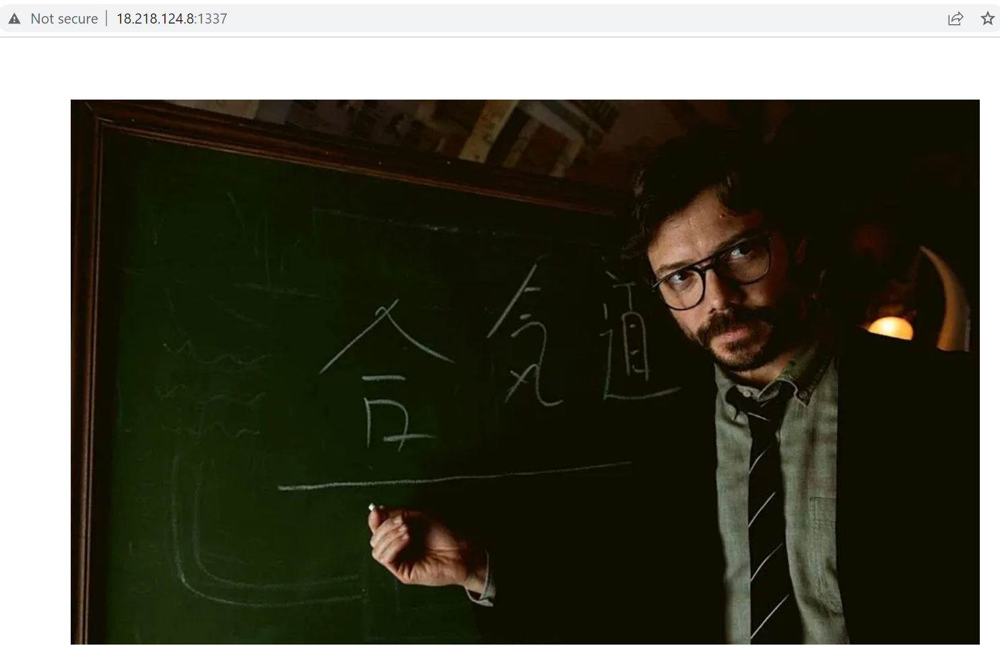

# Aikido

## Description

* Target URL: http://18.116.82.37:1337/

## Solution

We've given a downloadable and a target URL. Browsing to URL presents a blank page with image. 



Given file is a python script. 

```python
import os
from flask import *
from Crypto.Cipher import AES


KEY = os.urandom(16)
FLAG = ?

app = Flask(__name__)

@app.route('/encrypt/message/<plaintext>/<iv>/')
def encrypt(plaintext, iv):
    plaintext = bytes.fromhex(plaintext)
    iv = bytes.fromhex(iv)
    if len(iv) != 16:
        return {"error": "IV length must be 16"}

    cipher = AES.new(KEY, AES.MODE_OFB, iv)
    encrypted = cipher.encrypt(plaintext)
    ciphertext = encrypted.hex()

    return {"encrypted_msg": ciphertext}


@app.route('/secret/message/professor')
def encrypt_flag():
    iv = os.urandom(16)

    cipher = AES.new(KEY, AES.MODE_OFB, iv)
    encrypted = cipher.encrypt(FLAG.encode())
    ciphertext = iv.hex() + encrypted.hex()

    return {"encrypted_msg": ciphertext}

app.run()
```

It has two routes. 

* `/secret/message/professor` : returns a ciphertext of `FLAG` encrypted using AES stream cipher in open feedback mode. 
* `/encrypt/message/<text>/<iv>` : takes input from user both the text and IV while encrypting the data and returns ciphertext. 

Stream ciphers is produce a pseudorandom keystream which is then XORed with the plaintext. One advantage of stream ciphers is that they can work of plaintext of arbitrary length, with no padding required.

Since the core operation behind AES is to XOR the plaintext with keystream, we can obtain the secret message and retrieve the IV which is of first 16 bytes (32 bytes since hex) in the ciphertext. The remaining data is ciphertext. We can then feed these both values to encrypt which in return does the decryption since XOR of ciphertext against same IV with same key produces plaintext. 

* Encryption = plaintext ⊕ key ⊕ iv

* Decryption = ciphertext ⊕ key ⊕ iv

This can be scripted as below.

```python
#!/usr/bin/python
import json
import requests
import binascii

url='http://18.218.124.8:1337/'

"""
We obtain encrypted flag with random IV and unknown KEY
"""
def get_enc_flag():
        r = requests.get(url+'secret/message/professor')
        return json.loads(r.text)['encrypted_msg']

"""
As OFB mode is symmetrical, encryption and decryption are similar :)
"""
def dec_flag():
        enc=get_enc_flag()
        iv,flag=enc[:32],enc[32:]
        r = requests.get(url+'encrypt/message/{}/{}/'.format(flag,iv))
        print(binascii.unhexlify(json.loads(r.text)['encrypted_msg']))

dec_flag()
```

Running the script gives the secret message between professor and palermo as well as flag. 

```bash
python3 solver.py 
b'Palermo: Plan Aikido activated\nProfessor: Roger.\nACVCTF{0mg_1ts_0fb_4nd_0_0_w34k}'
```

