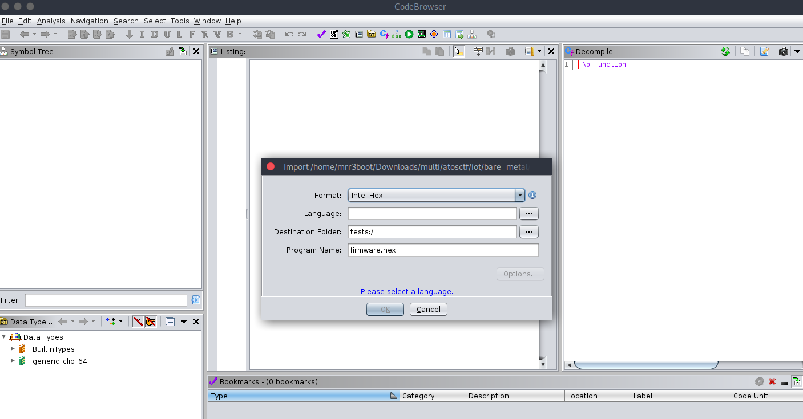
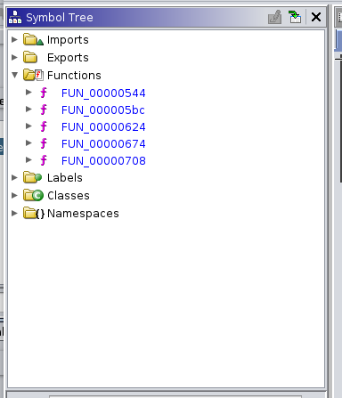
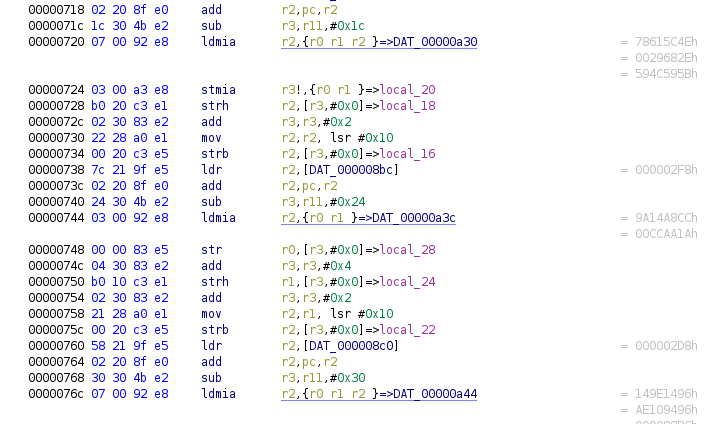
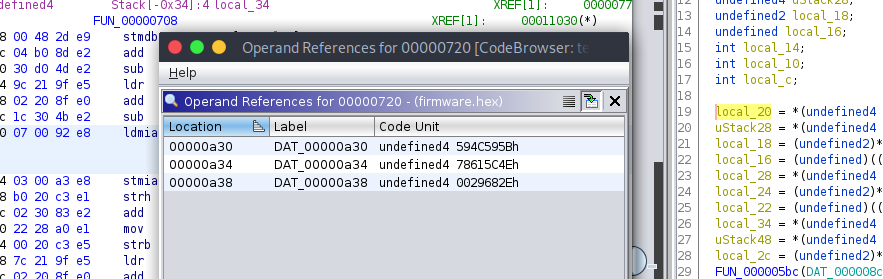
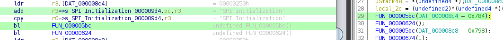
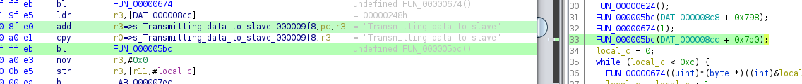

# Everything Seemed Insignificant

## Description


## Solution

We've given a `firmware.hex` file. 

```bash
file firmware.hex 
firmware.hex: ASCII text, with CRLF line terminators
```

Checking the contents we see that the firmware is in the intel hex format.

```bash
cat firmware.hex  | head
:100154002F6C69622F6C642D6C696E75782E736FC9
:030164002E330037
:10016800040000001400000003000000474E550082
...
```

As said in the description, the microcontroller is `LPC2148`. We can read more about it from [here](https://www.nxp.com/docs/en/data-sheet/LPC2141_42_44_46_48.pdf). These controllers generally operates on ARM architecture. Let's open up [ghidra](https://ghidra-sre.org/) and drag given firmware file into code browser.



The ARM processors are little endian by default. Let's choose little endian in the Language field.


We see there are several functions present in the symbol tree.



Checking one by one we see `FUN_00000708` function looks interesting.

```c
undefined4 FUN_00000708(void)

{
  undefined4 local_34;
  undefined4 uStack48;
  undefined2 local_2c;
  undefined4 local_28;
  undefined2 local_24;
  undefined local_22;
  undefined4 local_20;
  undefined4 uStack28;
  undefined2 local_18;
  undefined local_16;
  int local_14;
  int local_10;
  int local_c;
  
  local_20 = *(undefined4 *)(DAT_000008b8 + 0x720);
  uStack28 = *(undefined4 *)(DAT_000008b8 + 0x724);
  local_18 = (undefined2)*(undefined4 *)(DAT_000008b8 + 0x728);
  local_16 = (undefined)((uint)*(undefined4 *)(DAT_000008b8 + 0x728) >> 0x10);
  local_28 = *(undefined4 *)(DAT_000008bc + 0x744);
  local_24 = (undefined2)*(undefined4 *)(DAT_000008bc + 0x748);
  local_22 = (undefined)((uint)*(undefined4 *)(DAT_000008bc + 0x748) >> 0x10);
  local_34 = *(undefined4 *)(DAT_000008c0 + 0x76c);
  uStack48 = *(undefined4 *)(DAT_000008c0 + 0x770);
  local_2c = (undefined2)*(undefined4 *)(DAT_000008c0 + 0x774);
  FUN_000005bc(DAT_000008c4 + 0x784);
  FUN_00000624();
  FUN_000005bc(DAT_000008c8 + 0x798);
  FUN_00000674(1);
  FUN_000005bc(DAT_000008cc + 0x7b0);
  local_c = 0;
  while (local_c < 0xc) {
    FUN_00000674((uint)*(byte *)((int)&local_20 + local_c) ^ 0x1a);
    local_c = local_c + 1;
  }
  local_10 = 0;
  while (local_10 < 8) {
    FUN_00000674((uint)(*(byte *)((int)&local_28 + local_10) >> 1) ^ 0x39);
    local_10 = local_10 + 1;
  }
  local_14 = 0;
  while (local_14 < 0xb) {
    FUN_00000674((uint)(*(byte *)((int)&local_34 + local_14) >> 1) ^ 0x39);
    local_14 = local_14 + 1;
  }
  FUN_000005bc(DAT_000008d0 + 0x89c);
  FUN_00000674(0);
  return 0;
}
```

We see that it loads and stores the hardcoded values to general purpose registers using `LDMIA` and `STMIA` instructions.



The `DAT_00000a30` values are in order.



Later it calls `FUN_000005bc` with string `SPI Initialization`.

```c
FUN_000005bc(DAT_000008c4 + 0x784);
```



Let's look at `FUN_0000005bc`.

```c
int FUN_000005bc(int param_1)

{
  int iVar1;
  byte local_9;
  
  local_9 = 0;
  iVar1 = param_1;
  while (*(char *)(param_1 + (uint)local_9) != '\0') {
    iVar1 = FUN_00000544((uint)*(byte *)(param_1 + (uint)local_9));
    local_9 = local_9 + 1;
  }
  return iVar1;
}
```

This just iterates over a given string and calls another function `FUN_00000544` with each character.

```c
uint FUN_00000544(uint param_1)

{
  *DAT_000005b0 = *DAT_000005b0 & 0xffff00ff | (param_1 & 0xff) << 8;
  *DAT_000005b4 = 0x50000;
  *DAT_000005b8 = 0x20000;
  *DAT_000005b8 = 0x40000;
  return param_1;
}
```

From the standard header [file](https://www.keil.com/dd/docs/arm/philips/lpc214x.h) of LPC2148 microcontroller we can corelate the configuration.

```c
#define IO0PIN          (*((volatile unsigned long *) 0xE0028000))
#define IO0SET          (*((volatile unsigned long *) 0xE0028004))
#define IOPIN0          (*((volatile unsigned long *) 0xE0028000))
```

So the code is writing each character to slave device using the above configuration. Before the loop it sends `Transmitting the data` string to the device.



Let's look into the while loops.

```c
while (local_c < 0xc) {
    FUN_00000674((uint)*(byte *)((int)&local_20 + local_c) ^ 0x1a);
    local_c = local_c + 1;
  }
  local_10 = 0;
  while (local_10 < 8) {
    FUN_00000674((uint)(*(byte *)((int)&local_28 + local_10) >> 1) ^ 0x39);
    local_10 = local_10 + 1;
  }
  local_14 = 0;
  while (local_14 < 0xb) {
    FUN_00000674((uint)(*(byte *)((int)&local_34 + local_14) >> 1) ^ 0x39);
    local_14 = local_14 + 1;
  }
```

These loops performs bitwise operations over the values stored in `local_c` and `local_10` parameters. Then they call `FUN_00000674` function with those values.

```c
undefined4 FUN_00000674(undefined4 param_1)

{
  *DAT_000006f8 = 0x80;
  *DAT_000006fc = (ushort)(byte)param_1;
  do {
  } while (-1 < *DAT_00000700);
  *DAT_00000704 = 0x80;
  return param_1;
}
```

We can map `DAT_*` values from [header](https://www.keil.com/dd/docs/arm/philips/lpc214x.h) file.

```c
/* SPI0 (Serial Peripheral Interface 0) */
#define S0SPSR          (*((volatile unsigned char *) 0xE0020004))
#define S0SPDR          (*((volatile unsigned short*) 0xE0020008))
```

These are the configurations for SPI interface.

- `S0SPSR` - SPI Status Register
- `S0SPDF` - SPI Data Register

With this knowledge we can infer that the above function performs SPI write/status operations. Let's write a simple python script to decode the hardcoded information.

```python
import string

first = [0x5b, 0x59, 0x4c, 0x59, 0x4e, 0x5c, 0x61, 0x78, 0x2e, 0x68, 0x29]
second = [0xcc, 0xa8, 0x14, 0x9a, 0x1a, 0xaa, 0xcc]
third = [0x96, 0x14, 0x9e, 0x14, 0x96, 0x94, 0x10, 0xae, 0xbc, 0x88]

result=''
for i in first:
	result+=chr(i^0x1a)
for j in second:
	result+=chr((j>>1)^0x39)
for k in third:
	result+=chr((k>>1)^0x39)
print(result)
```

Running the script reveals the flag.

```bash
python3 solver.py 
ACVCTF{b4r3_m3t4l_r3v3rs1ng}
```

