# Unlimited Power

## Description

Are you **strong** enough for this one?

## Solution

Challenge provides us a [UnlimitedPower.prg](UnlimitedPower.prg) file. Running `file` command reveals this some sort of binary data. 

```bash
file UnlimitedPower.prg 
UnlimitedPower.prg: data
```

I found some information by looking at `strings` output. 

```bash
strings UnlimitedPower.prg 
you are getting up to speed
can i fake my power data??
        .fit file
you are weak
are you roglic?
sprinting!
I'm not reading any wattz :/
Simulation Wattz
legs burning
attacking!
are you mezgec?
this is easy
        g       &
UnlimitedPower
```

But i really had no idea on what to look at. Searching a bit on `.fit file` reveals few [blogposts](https://developer.garmin.com/fit/fitcsvtool/editing-files/) on how to convert this file to csv using fit2csv tool. The site explains what `FIT` is 

```
The Flexible and Interoperable Data Transfer (FIT) protocol is designed specifically for the storing and sharing of data that originates from sport, fitness and health devices. The FIT protocol defines a set of data storage templates (FIT messages) that can be used to store information such as user profiles, activity data, courses, and workouts. It is specifically designed to be compact, interoperable and extensible.
```

In general its used to transfer activity data to cloud platforms. Searching a bit more on `Garmin` and `prg` key words takes to [forum](https://forums.garmin.com/developer/connect-iq/f/discussion/6338/prg-and-settings) link where they speak about Connect IQ applications. By following [guilde](https://developer.garmin.com/connect-iq/connect-iq-basics/getting-started/) from Garmin i've configured Connect IQ SDK Manager with Eclipse (but later got to know that its not needed at all xD). 

To understand how that works i've opened Connect IQ SDK Manager and downloaded some of the devices and Connect IQ SDK. 

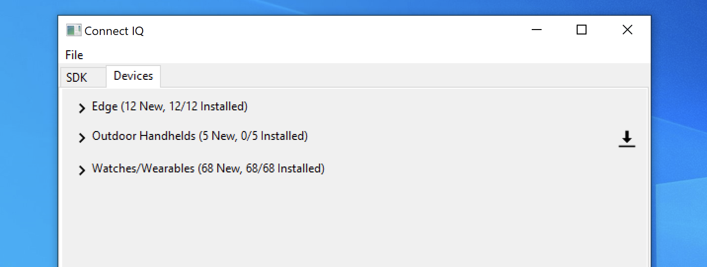

It downloaded all required tools to my `%appdata%\Garmin\ConnectIQ\Sdks\connectiq-sdk-win-4.0.1-2021-04-21-1bb58d97e\bin` folder. Running `connectiq` launches the simulator. `Garmin` [documentation](https://developer.garmin.com/connect-iq/connect-iq-basics/getting-started/) says below. 

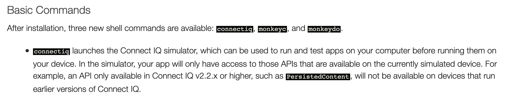

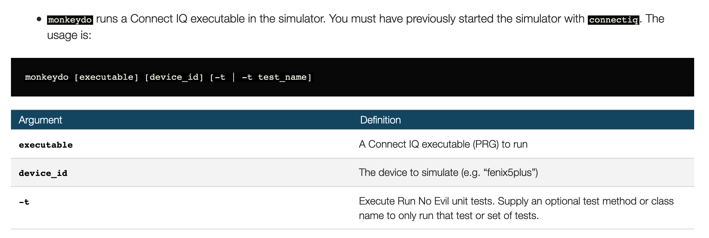

`monkeydo` runs the given `UnlimitedPower.prg` but it require simulator. So we first run `connectiq` which starts the simulator.

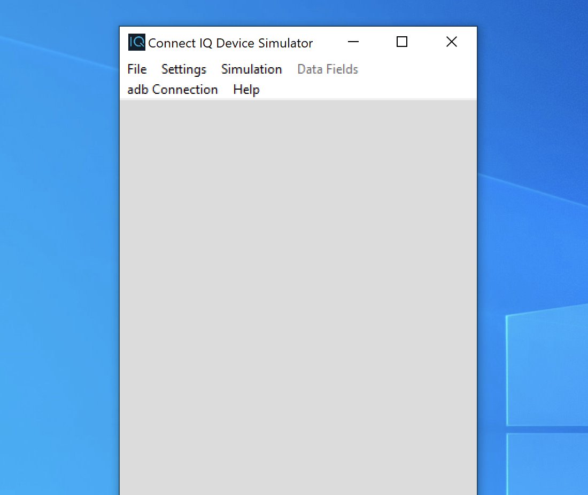

then `monkeydo UnlimitedPower.prg edge_520` to simulate the application.

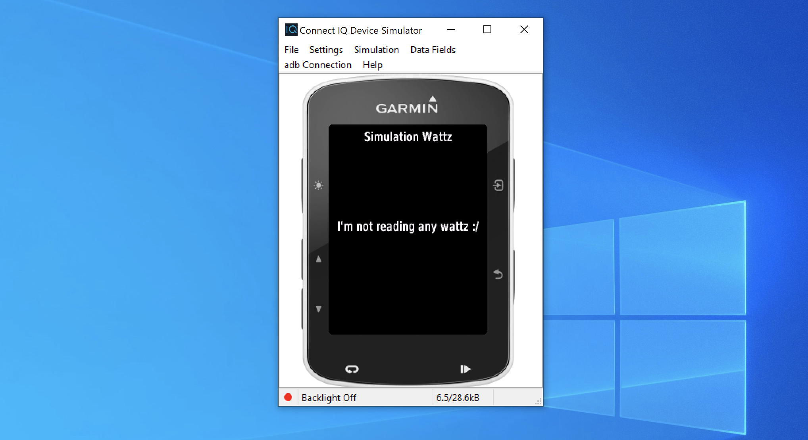

App says its not able to read any power readings. Clicking on `Simulation > FIT Data > Simulate Data` starts showing some data on the app.

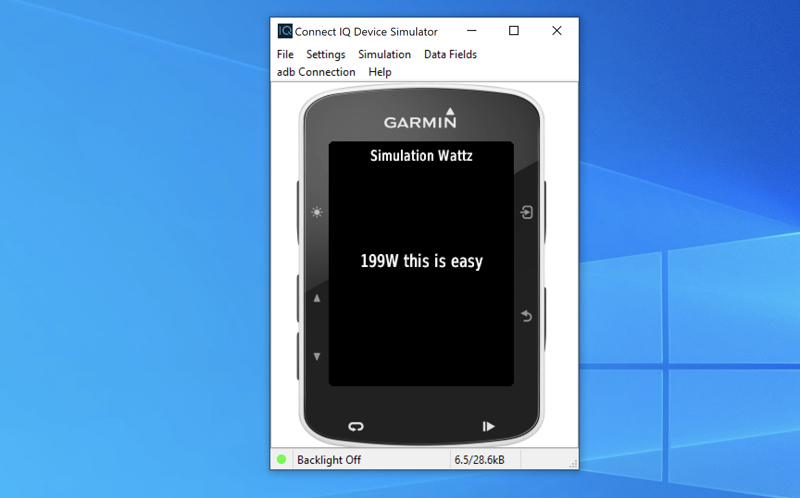

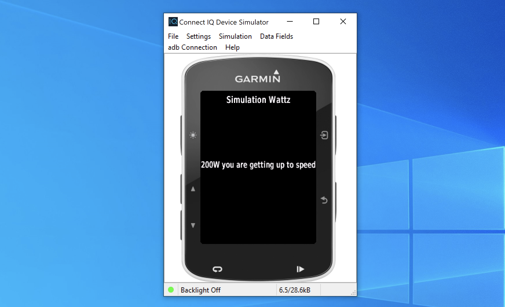

There's also an options to read data from file. 

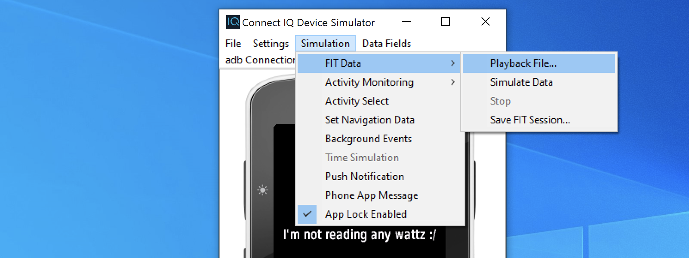

I've downloaded [FITSDK](https://developer.garmin.com/fit/download/) which has some example data files. Loading `Activity.fit` file in the simulator shows `0W`. 

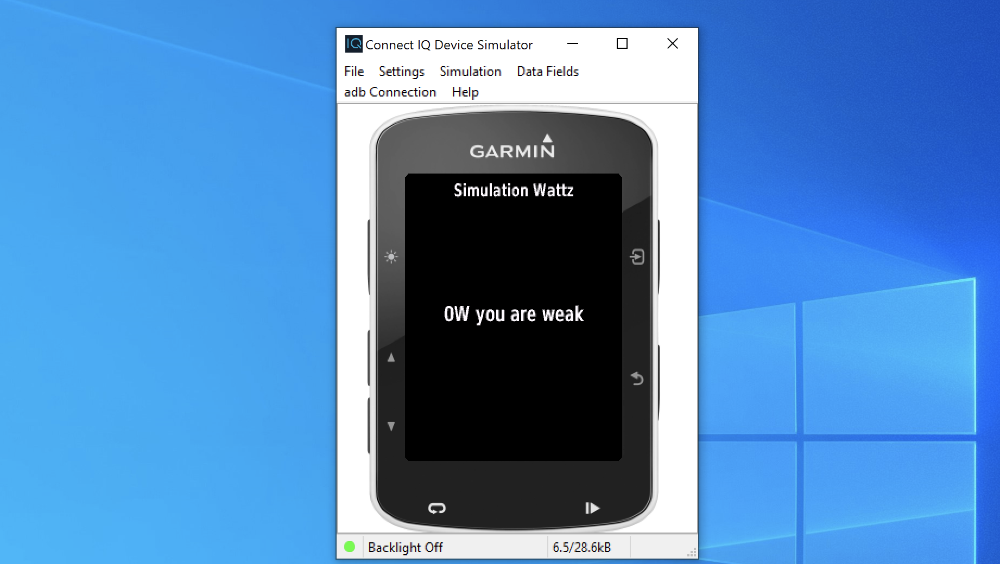

Opening the `Activity.csv` we see a column which has POWER set to 0 :slightly_smiling_face:

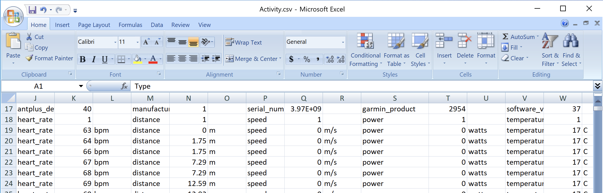

I just modified that column values to 3000 watts power. Hard part is to convert this file back to FIT format. There's an online [site](http://garmin.kiesewetter.nl/) which helps in this conversion but it detects the suspecious data and fixes then automatically. Some of the fixes are.

* mark corrupt records as suspected
  * distance change > 10km
  * speedchange>20m/s
  * postionchange>10km
  * powerchange>2000w

* Recalculate lap and session information
  * speed
  * cadence
  * power

This won't help and i failed miserably on this. Reading Garmin website shows that FIT SDK has tools which helps in conversion :wink:. Using `FitCSVTool.jar` i'm able to convert CSV back to FIT format.

```bash
java -jar FitCSVTool.jar -c activity.csv activity.fit
FIT CSV Tool - Protocol 2.0 Profile 21.53 Release
activity.csv encoded into FIT binary file activity.fit.
```

Loading this modified fit file to simulator shows the flag. 

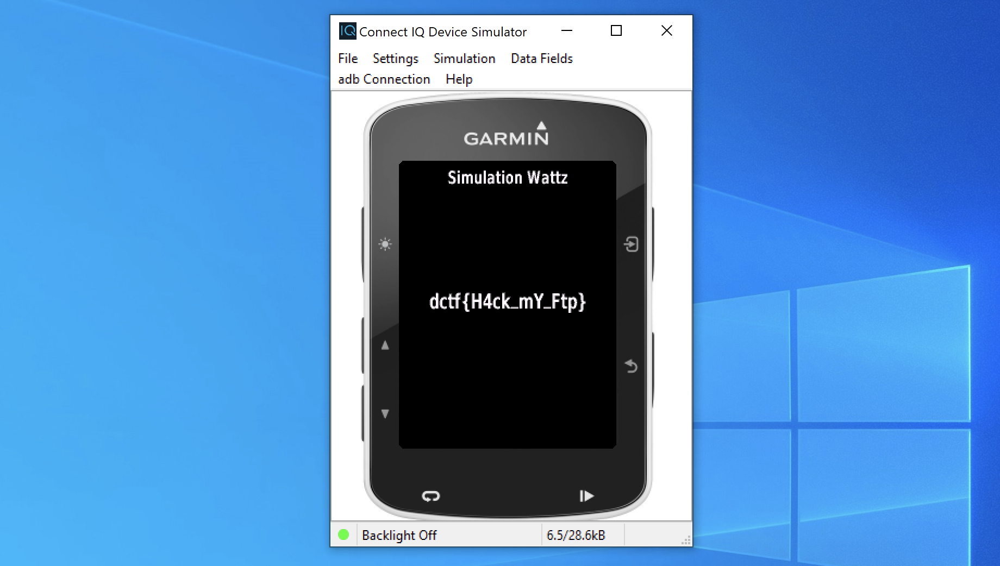

