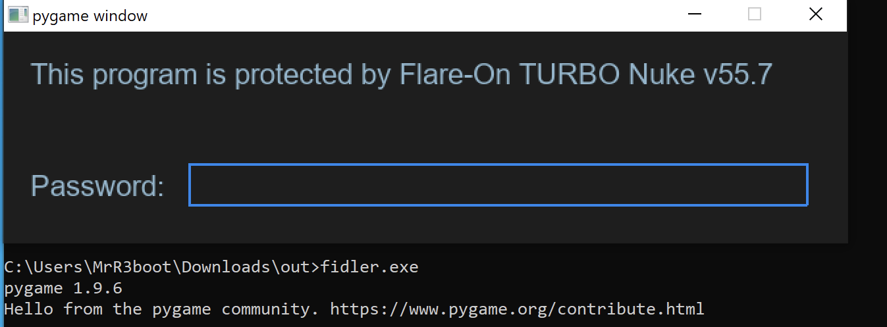
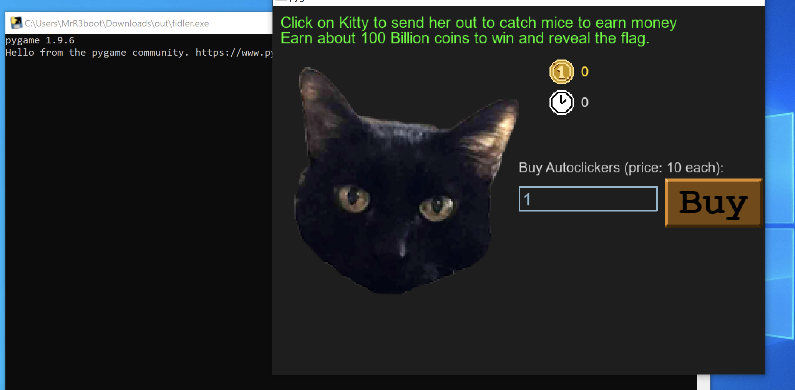
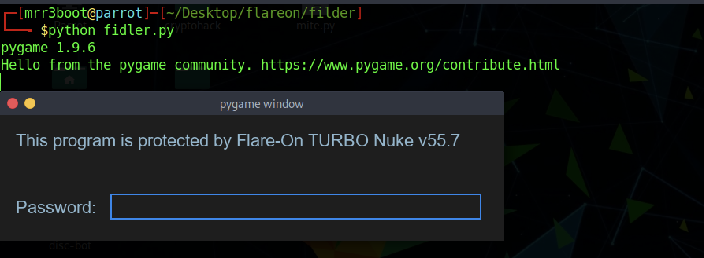
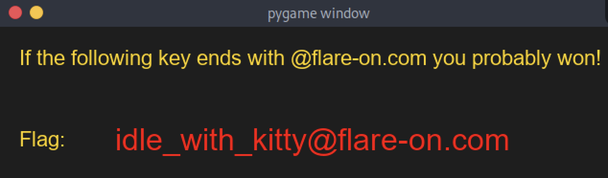

# Filder

## Description

This is a simple game. Win it by any means necessary and the victory screen will reveal the flag. Enter the flag here on this site to score and move on to the next level.

This challenge is written in Python and is distributed as a runnable EXE and matching source code for your convenience. You can run the source code directly on any Python platform with PyGame if you would prefer.


## Walkthrough

We've given a compressed file which consists of required files for the challenge.

```bash
┌─[mrr3boot@parrot]─[~/Desktop/flareon/filder]
└──╼ $ls -al
total 20964
drwxr-xr-x 1 mrr3boot mrr3boot      112 Sep 14 06:03 .
drwxr-xr-x 1 mrr3boot mrr3boot       12 Sep 14 05:46 ..
-rw-r--r-- 1 mrr3boot mrr3boot     5663 Jul 28 08:07 controls.py
-rw-r--r-- 1 mrr3boot mrr3boot 10233556 Sep 10 09:39 fidler.exe
-rw-r--r-- 1 mrr3boot mrr3boot     9458 Sep 10 09:31 fidler.py
drwx------ 1 mrr3boot mrr3boot       38 Sep 11 09:35 fonts
drwx------ 1 mrr3boot mrr3boot      118 Sep 11 09:35 img
-rw-r--r-- 1 mrr3boot mrr3boot      432 Sep 11 09:40 Message.txt
```

This challenge can be solved in 2 different approaches (could be many but i'm lazy :P)

### Approach 1

We can look at `fidler.exe` by running it on windows.



We've to identify the password to unlock the access. Let's look at `fidler.py` file to understand the password logic.

```python
import pygame as pg
pg.init()
from controls import *

current_coins = 0           
current_autoclickers = 0
buying = False

def password_check(input):
    altered_key = 'hiptu'
    key = ''.join([chr(ord(x) - 1) for x in altered_key])
    return input == key
...
```

The script contains `password_check()` function which takes `hiptu` as `altered_key` and it shifts each letter by one position left. 

 ```python
>>> altered_key = 'hiptu'
>>> key = ''.join([chr(ord(x) - 1) for x in altered_key])
>>> key
'ghost'
 ```

The password is `ghost` and it gives us the access.



To obtain the flag we've to earn around 100 billion coins. We can do this by buying autoclickers through kitty head but that can take around 2-3mins (doable). I prefer doing it by reversing the python code given.

Let's look at flag functions if any.

```python
def decode_flag(frob):
    last_value = frob
    encoded_flag = [1135, 1038, 1126, 1028, 1117, 1071, 1094, 1077, 1121, 1087, 1110, 1092, 1072, 1095, 1090, 1027,1127, 1040, 1137, 1030, 1127, 1099, 1062, 1101, 1123, 1027, 1136, 1054]
    decoded_flag = []

    for i in range(len(encoded_flag)):
        c = encoded_flag[i]
        val = (c - ((i%2)*1 + (i%3)*2)) ^ last_value
        decoded_flag.append(val)
        last_value = c

    return ''.join([chr(x) for x in decoded_flag])
```

The `fidler.py` file contains `decode_flag` function which has flag in encoded format that require a `last_value` through which it decodes the flag. Just below this function we can see a `victory_screen()` function that is calling `decode_flag()` function.

```python
def victory_screen(token):
    screen = pg.display.set_mode((640, 160))
    clock = pg.time.Clock()
    heading = Label(20, 20, 'If the following key ends with @flare-on.com you probably won!',
                    color=pg.Color('gold'), font=pg.font.Font('fonts/arial.ttf', 22))
    flag_label = Label(20, 105, 'Flag:', color=pg.Color('gold'), font=pg.font.Font('fonts/arial.ttf', 22))
    flag_content_label = Label(120, 100, 'the_flag_goes_here',
                               color=pg.Color('red'), font=pg.font.Font('fonts/arial.ttf', 32))

    controls = [heading, flag_label, flag_content_label]
    done = False

    flag_content_label.change_text(decode_flag(token))
...
```

Searching for `victory_screen` function shows below loop which has an exact logic for coin validation.

```python
    while not done:
        target_amount = (2**36) + (2**35)
        if current_coins > (target_amount - 2**20):
            while current_coins >= (target_amount + 2**20):
                current_coins -= 2**20
            victory_screen(int(current_coins / 10**8))
            return
...
```

If `current_coins` value greater than `target_amount-2**20` it calls `victory_screen` function. Let's calculate that value.

```python
>>> target_amount = 2**36 + 2**35
>>> target_amount = target_amount - 2**20
>>> target_amount/10**8
1030
```

Using this value we can now call `decode_flag` function to obtain the flag.

```python
>>> def decode_flag(frob):
...   last_value = frob
...   encoded_flag = [1135, 1038, 1126, 1028, 1117, 1071, 1094, 1077, 1121, 1087, 1110, 1092, 1072, 1095, 1090, 1027,1127, 1040, 1137, 1030, 1127, 1099, 1062, 1101, 1123, 1027, 1136, 1054]
...   decoded_flag = []
...   for i in range(len(encoded_flag)):
...     c = encoded_flag[i]
...     val = (c - ((i%2)*1 + (i%3)*2)) ^ last_value
...     decoded_flag.append(val)
...     last_value = c
...   return ''.join([chr(x) for x in decoded_flag])
... 
>>> decode_flag(1030)
'idle_with_kitty@flare-on.com'
```


### Approach 2 (Easy & Lazy way)

We can install `pygame` module with `pip` and can run `fidler.py` directly.



Now i can simply patch the code to get rid of password logic.

```python
def password_check(input):
    altered_key = 'hiptu'
    key = ''.join([chr(ord(x) - 1) for x in altered_key])
    return True
```

We can now get to second stage of the challenge with any password as this check always returns true value :D. The logic is to have more coins. So i can have max coins through `current_coins` variable.

```python
current_coins=10000000000000
```

Having this value in place and running the script simply shows up the flag.

