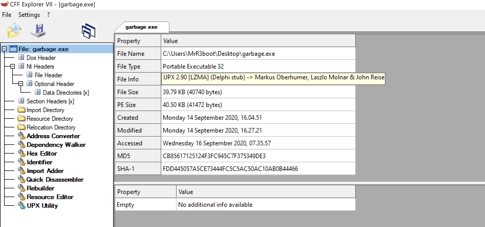
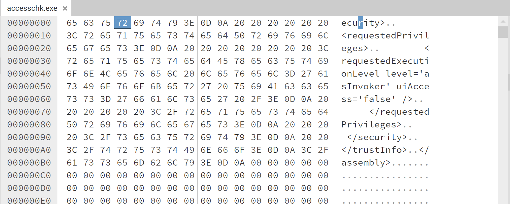
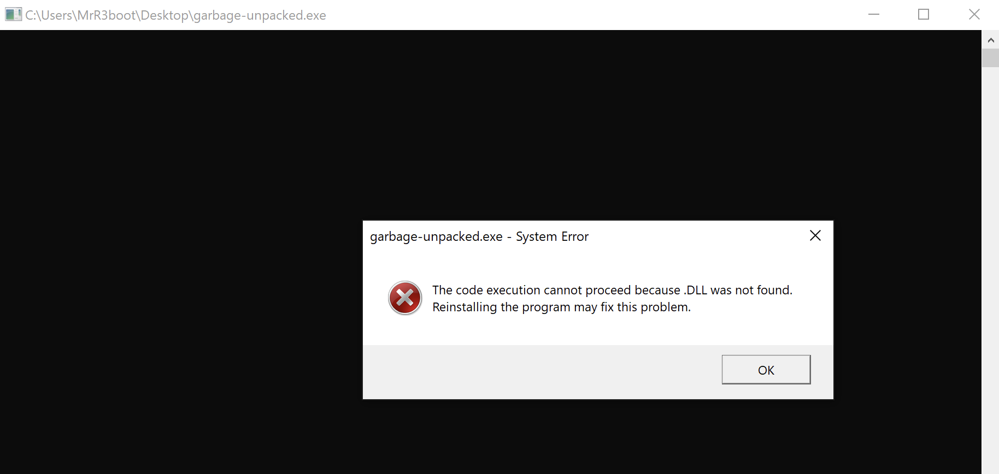
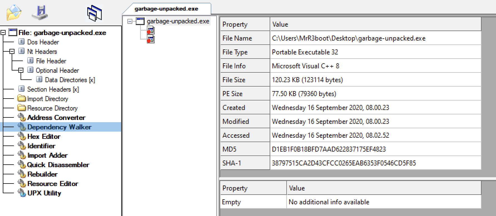
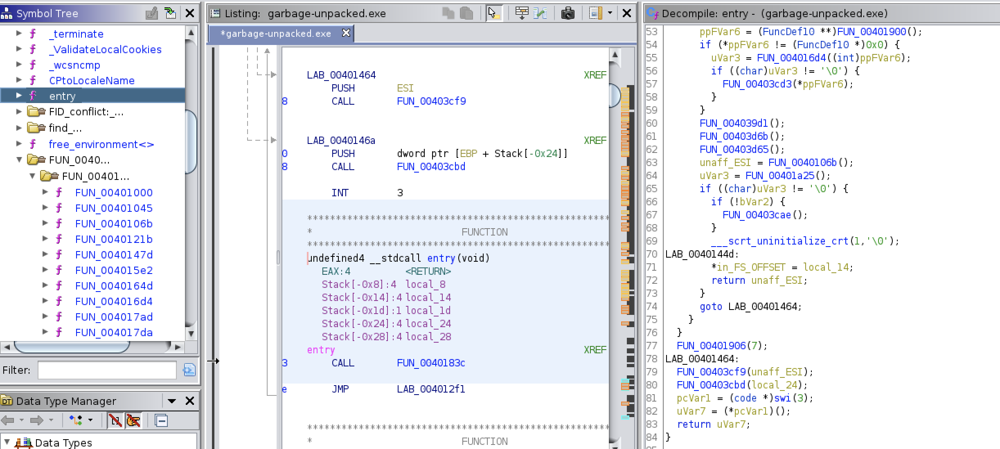

# Garbage


## Description

One of our team members developed a Flare-On challenge but accidentally deleted it. We recovered it using extreme digital forensic techniques but it seems to be corrupted. We would fix it but we are too busy solving today's most important information security threats affecting our global economy. You should be able to get it working again, reverse engineer it, and acquire the flag.


## Walkthrough

We've given a zip file containes `garbage.exe` binary. Let's try to run it.


We can't run it. The binary is UPX packed which can be seen through `CFF Explorer` or simply `file` command output. We can't simply analyse it in ghidra/ida without unpacking it.

```bash
file garbage.exe 
garbage.exe: PE32 executable (console) Intel 80386, for MS Windows, UPX compressed
```



CFF also highlights that it is a 32bit binary. The strings output shows that the binary is missing some bytes at the end.

```bash
strings garbage.exe
.....
--U3M
II_>
@?3!
i"!m&'!{
g)      :
IS      +"$r
#;H@
XPTPSW
<?xml version='1.0' encoding='UTF-8' standalone='yes'?>
<assembly xmlns='urn:schemas-microsoft-com:asm.v1' manifestVersion='1.0'>
  <trustInfo xmlns="urn:schemas-microsoft-com:asm.v3">
    <securit
```

I've taken windows internals example [accesschk](https://docs.microsoft.com/en-us/sysinternals/downloads/accesschk) to compare both the binaries. 



This binary do have more bytes at the end. We can just copy those missing bytes in hexeditor and fix the `garbage.exe`. 

```bash
ls -al
total 1404
drwxr-xr-x 1 mrr3boot mrr3boot     120 Sep 15 22:25 .
drwxr-xr-x 1 mrr3boot mrr3boot      44 Sep 15 10:36 ..
-rw-r--r-- 1 mrr3boot mrr3boot   40740 Apr 24 08:59 garbage.exe
-rw-r--r-- 1 mrr3boot mrr3boot   85226 Sep 14 09:53 garbage-fix.exe
```

After fixing the binary we can see it has large difference in size with the original one. We can now try to unpack the binary using `upx` utility.

```bash
upx -d garbage-fix.exe -o garbage-unpacked.exe
                       Ultimate Packer for eXecutables
                          Copyright (C) 1996 - 2020
UPX 3.96        Markus Oberhumer, Laszlo Molnar & John Reiser   Jan 23rd 2020

        File size         Ratio      Format      Name
   --------------------   ------   -----------   -----------
    123114 <-     85226   69.23%    win32/pe     garbage-unpacked.exe

Unpacked 1 file.
```

```bash
file garbage-unpacked.exe 
garbage-unpacked.exe: PE32 executable (console) Intel 80386, for MS Windows
```

The unpacked binary is of 123KB in size. Running it now shows new errors.



Dependency Walker in CFF Explorer tool shows that two unknown files were missing. 



Its so tedious task to fix those missing DLLs by looking at Import Address Table. Let's open the binary in ghidra. 



The `entry` or `main` function is loading several other functions. `FUN_0040106b` function looks interesting where it holds some strings in it. 

```c++
void FUN_0040106b(void)
{                                                                      
  ....
  local_8 = DAT_00413004 ^ (uint)&stack0xfffffffc;
  iVar2 = 0x19;
  local_5c = 0x2c332323;
  local_58 = 0x49643f0e;
  puVar3 = (undefined4 *) "nPTnaGLkIqdcQwvieFQKGcTGOTbfMjDNmvibfBDdFBhoPaBbtfQuuGWYomtqTFqvBSKdUMmciqKSGZaosWCSoZlcIlyQpOwkcAgw ";
  puVar4 = local_12c;
  while (iVar2 != 0) {
    iVar2 = iVar2 + -1;
    *puVar4 = *puVar3;
    puVar3 = puVar3 + 1;
    puVar4 = puVar4 + 1;
  }
  iVar2 = 0x19;
  local_54 = 0x40a1e0a;
  *(undefined2 *)puVar4 = *(undefined2 *)puVar3;
  local_50 = 0x1a021623;
  local_4c = 0x24086644;
  puVar3 = (undefined4 *)"KglPFOsQDxBPXmclOpmsdLDEPMRWbMDzwhDGOyqAkVMRvnBeIkpZIhFznwVylfjrkqprBPAdPuaiVoVugQAlyOQQtxBNsTdPZgDH ";
  puVar4 = local_c4;
  while (iVar2 != 0) {
    iVar2 = iVar2 + -1;
    *puVar4 = *puVar3;
    puVar3 = puVar3 + 1;
    puVar4 = puVar4 + 1;
  }
  local_48 = 0x2c741132;
  local_44 = 0xf422d2a;
  local_40 = 0xd64503e;
  local_3c = 0x171b045d;
  local_38 = 0x5033616;
  local_34 = 0x8092034;
  local_30 = 0xe242163;
  local_2c = 0x58341415;
  local_28 = 0x3a79291a;
  local_24 = 0x58560000;
  local_20 = 0x54;
  local_1c = 0x3b020e38;
  local_18 = 0x341b3b19;
  local_14 = 0x3e230c1b;
  local_10 = 0x42110833;
  local_c = 0x731e1239;
  *(undefined2 *)puVar4 = *(undefined2 *)puVar3;
  FUN_00401000(local_13c,(int)&local_1c,0x14,(int)local_c4);
  iVar2 = (*(code *)(undefined *)0x12418)(local_13c[0],0x40000000,2,0,2,0x80,0);
  FUN_00401045(local_13c);
  if (iVar2 != -1) {
    local_140 = 0;
    FUN_00401000(local_13c,(int)&local_5c,0x3d,(int)local_12c);
    (*(code *)(undefined *)0x123f8)(iVar2,local_13c[0],0x3d,&local_140,0);
    FUN_00401045(local_13c);
    (*(code *)(undefined *)0x12426)(iVar2);
    FUN_00401000(local_13c,(int)&local_1c,0x14,(int)local_c4);
    (*(code *)(undefined *)0x12442)(0,0,local_13c[0],0,0,0);
    FUN_00401045(local_13c);
  }
  uVar1 = (*(code *)(undefined *)0x123e4)(0xffffffff);
  (*(code *)(undefined *)0x12404)(uVar1);
  FUN_0040121b();
  return;
}
```

This function then calls `FUN_00401000` with some input arguments. 

```c++
int * __thiscall FUN_00401000(void *this,int param_1,int param_2,int param_3)

{
  uint uVar1;
  uVar1 = 0;
  *(int *)this = param_1;
  *(int *)((int)this + 4) = param_2;
  *(int *)((int)this + 8) = param_3;
  *(undefined4 *)((int)this + 0xc) = 0x66;
  if (param_2 != 0) {
    do {
      *(byte *)(*(int *)this + uVar1) =
           *(byte *)(*(int *)this + uVar1) ^
           *(byte *)(uVar1 % *(uint *)((int)this + 0xc) + *(int *)((int)this + 8));
      uVar1 = uVar1 + 1;
    } while (uVar1 < *(uint *)((int)this + 4));
  }
  return (int *)this;
}
```

This function takes 4 input arguments and simply does XOR of `param_1` and `param_3` values. Let's look at first call to this function.

```c++
FUN_00401000(local_13c,(int)&local_1c,0x14,(int)local_c4);
```

Here 

* param_1 = (int)&local_1c
* param_2 = 0x14 (20 decimal value)
* param_3 = (int)local_c4

In C++ `(int)&` points to the left reference of the actual string which means its pointing to the starting of the string. In our case `local_1c` is the starting of the string.

```python
str1  = p32(0x3b020e38)
str1 += p32(0x341b3b19)
str1 += p32(0x3e230c1b)
str1 += p32(0x42110833)
str1 += p32(0x731e1239)
```

we now have `local_1c`. `FUN00401000` loops over 20 bytes while XORing. So `local_1c` (str1) matches that length. `local_c4` is referenced to `puVar3` value.

```c++
puVar3 = (undefined4*)
  "KglPFOsQDxBPXmclOpmsdLDEPMRWbMDzwhDGOyqAkVMRvnBeIkpZIhFznwVylfjrkqprBPAdPuaiVoVugQAlyOQQtxBNsTdPZgDH ";
  puVar4 = local_c4;
  while (iVar2 != 0) {
    iVar2 = iVar2 + -1;
    *puVar4 = *puVar3;
    puVar3 = puVar3 + 1;
    puVar4 = puVar4 + 1;
  }
```

```python
key1 = "KglPFOsQDxBPXmclOpmsdLDEPMRWbMDzwhDGOyqAkVMRvnBeIkpZIhFznwVylfjrkqprBPAdPuaiVoVugQAlyOQQtxBNsTdPZgDH"
```

This key is of 100 bytes length. So we can just take 20 bytes and do xor with str1 value.

```python
print(''.join([chr(i^(ord(j))) for i,j in zip(str1,key1[:20])]))
```

This prints the following string.

```bash
python3 do.py 
sink_the_tanker.vbs\x00
```

Let's look at other `FUN00401000` call.

```c++
FUN_00401000(local_13c,(int)&local_5c,0x3d,(int)local_12c);
```

This require a 61 (0x3d) byte length string to perform XOR. The `param_1` is pointing to `local_5c`. We can form the next required string starting from `local_5c` address.

```python
str2  = p32(0x2c332323)
str2 += p32(0x49643f0e)
str2 += p32(0x40a1e0a)
str2 += p32(0x1a021623)
str2 += p32(0x24086644)
str2 += p32(0x2c741132)
str2 += p32(0xf422d2a)
str2 += p32(0xd64503e)
str2 += p32(0x171b045d)
str2 += p32(0x5033616)
str2 += p32(0x8092034)
str2 += p32(0xe242163)
str2 += p32(0x58341415)
str2 += p32(0x3a79291a)
str2 += p32(0x58560000)
```

This matches the length. `local_12c` is referencing to `puVar3`. 

```c++
puVar3 = (undefined4 *) "nPTnaGLkIqdcQwvieFQKGcTGOTbfMjDNmvibfBDdFBhoPaBbtfQuuGWYomtqTFqvBSKdUMmciqKSGZaosWCSoZlcIlyQpOwkcAgw ";
  puVar4 = local_12c;
  while (iVar2 != 0) {
    iVar2 = iVar2 + -1;
    *puVar4 = *puVar3;
    puVar3 = puVar3 + 1;
    puVar4 = puVar4 + 1;
  }
```

We can consider this as `key2` .

```python
key2 = "nPTnaGLkIqdcQwvieFQKGcTGOTbfMjDNmvibfBDdFBhoPaBbtfQuuGWYomtqTFqvBSKdUMmciqKSGZaosWCSoZlcIlyQpOwkcAgw"
```

We can now simply XOR both the strings to get the flag.

```python
print(''.join([chr(i^(ord(j))) for i,j in zip(str2,key2)]))
```

```bash
python3 do.py
MsgBox("Congrats! Your key is: C0rruptGarbag3@flare-on.com")
```

